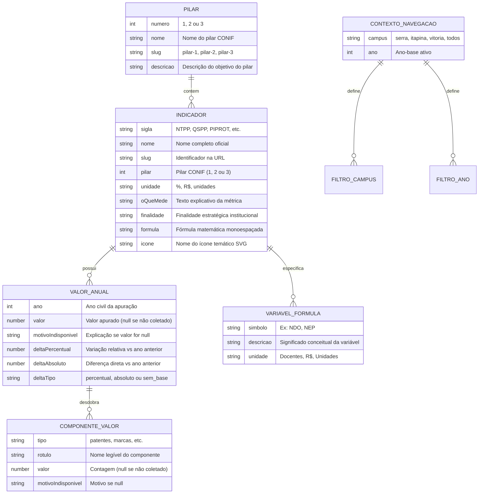

# Data Model: Visual Redesign (Figma Mock)

**Feature**: `005-figma-visual-redesign` | **Date**: 2026-09-22 | **Spec**: [spec.md](./spec.md)

Este documento especifica o modelo de dados, entidades conceituais, estruturas tipadas e regras de validação para a reformulação visual do painel de indicadores do IFES.

---

## 1. Entidades Principais



---

## 2. Estruturas TypeScript

### 2.1 Variável da Fórmula de Cálculo (`VariavelFormula`)

```typescript
export interface VariavelFormula {
  simbolo: string; // Ex: 'NDO', 'NEP'
  descricao: string; // Ex: 'Número de docentes da carreira EBTT...'
  unidade: string; // Ex: 'Docentes', 'R$', 'Unidades'
}
```

### 2.2 Estrutura Ampliada do Indicador (`Indicador`)

```typescript
export interface Indicador {
  sigla: string;
  nome: string;
  slug: string;
  pilar: 1 | 2 | 3;
  unidade: string;
  oQueMede: string;
  finalidade: string;
  formula: string;
  icone: 'academic' | 'network' | 'patent' | 'project' | 'chart' | 'default';
  variaveis?: VariavelFormula[];
  motivoIndisponivel?: string;
  temValores?: boolean;
}
```

### 2.3 Resolução de Variação (Delta)

```typescript
export type TipoDelta = 'percentual' | 'absoluto' | 'sem_base';

export interface VariavelDelta {
  tipo: TipoDelta;
  valorFormatado: string; // Ex: '+12.5%', '-4.0%', '+3', 'Sem base anterior'
  positivo: boolean | null; // true (aumento), false (queda), null (neutro)
}
```

---

## 3. Regras de Transição e Validação de Estado

1. **Fidelidade Estrita de Nulos**:
   - Se `valor === null`:
     - O valor principal renderiza obrigatoriamente `"Dado indisponível"`.
     - O delta é avaliado como `'sem_base'` (`valorFormatado = "Sem base anterior"`).
     - Sob nenhuma hipótese o valor será transformado em `0`.
2. **Cálculo de Delta entre Exercícios**:
   - Dados os valores $V_t$ (ano selecionado) e $V_{t-1}$ (ano imediatamente anterior):
     - Se $V_t$ for nulo ou $V_{t-1}$ for nulo/inexistente $\rightarrow$ `tipo = 'sem_base'`.
     - Se $V_{t-1} > 0 \rightarrow$ `tipo = 'percentual'`, $\Delta = \frac{V_t - V_{t-1}}{V_{t-1}} \times 100\%$, formatado com uma casa decimal e sinal `▲ +` ou `▼ -`.
     - Se $V_{t-1} = 0 \rightarrow$ `tipo = 'absoluto'`, $\Delta = V_t - V_{t-1}$, formatado com sinal `+` ou `-`.
3. **Persistência de Contexto na URL**:
   - Os valores de `campus` e `ano` devem ser sempre validados contra o conjunto de opções válidas do dataset.
   - Parâmetros desconhecidos sofrem fallback seguro para `campus = 'todos'` e `ano = anoMaisRecente`.
