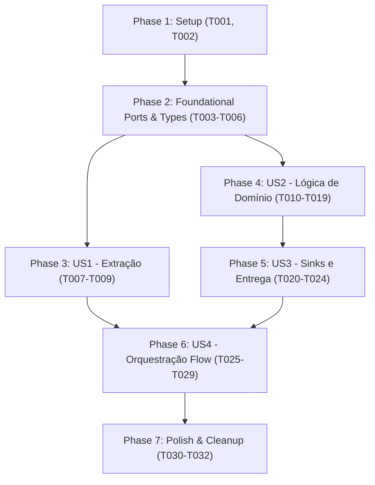

# Tasks: Refatoração da Arquitetura Hexagonal do ETL (Ports & Adapters)

**Input**: Design documents from `/specs/007-hexagonal-etl-refactor/` (`plan.md`, `spec.md`, `research.md`, `data-model.md`, `contracts/`, `quickstart.md`)

**Prerequisites**: `plan.md`, `spec.md`, `data-model.md`, `contracts/ports-contract.md`, `contracts/etl-cli.md`

**Tests**: Tests are MANDATORY for this project (Constitution Principle II, Test-First Development). All test suites must be written/adapted and verified to fail or pass according to the modular boundaries.

**Organization**: Tasks are grouped by user story to enable independent implementation and testing of each story.

## Format: `[ID] [P?] [Story] Description`

- **[P]**: Can run in parallel (different files, no dependencies)
- **[Story]**: Which user story this task belongs to ([US1], [US2], [US3], [US4])
- Exact file paths included in all descriptions

---

## Phase 1: Setup (Infrastructure & Directory Layout)

**Purpose**: Create the modular directory structure mirroring `horizon_etl/src/`

- [x] T001 Create hexagonal source directory structure (`src/etl/core/ports`, `src/etl/core/logic/resolvers`, `src/etl/core/logic/temporal`, `src/etl/core/logic/calculators`, `src/etl/adapters/sources`, `src/etl/adapters/sinks`, `src/etl/flows`)
- [x] T002 [P] Create mirrored test directory structure (`tests/etl/core`, `tests/etl/adapters`, `tests/etl/flows`)

---

## Phase 2: Foundational (Ports & Core Types)

**Purpose**: Define the abstract port contracts and domain types that all components depend on

**⚠️ CRITICAL**: Must complete before implementing adapters and domain logic

- [x] T003 [P] Define core canonical data types and shared interfaces in `src/etl/core/types.ts`
- [x] T004 [P] Define `ISource` extraction contract interface in `src/etl/core/ports/source.ts`
- [x] T005 [P] Define `ISink` persistence contract interface in `src/etl/core/ports/sink.ts`
- [x] T006 Define domain aggregates and computation types in `src/etl/core/logic/types.ts`

**Checkpoint**: Foundation ready — ports and core data models established.

---

## Phase 3: User Story 1 - Extração de Dados Isolada por Portas e Adaptadores (Priority: P1) 🎯 MVP Part 1

**Goal**: Isolate raw canonical data extraction behind the `ISource` port, replacing the misnamed `load.ts` with `ZipCanonicalSource`.

**Independent Test**: Instantiate `ZipCanonicalSource` directly, supply `exports_canonical.zip`, and assert that all typed canonical entities are loaded with deduplication and error handling.

### Tests for User Story 1 (MANDATORY per Constitution Principle II) ⚠️

- [x] T007 [P] [US1] Create unit tests for canonical zip extraction and error handling in `tests/etl/adapters/zip_canonical_source.test.ts`

### Implementation for User Story 1

- [x] T008 [US1] Implement `ZipCanonicalSource` implementing `ISource` in `src/etl/adapters/sources/zip_canonical_source.ts`
- [x] T009 [US1] Verify extraction against `exports_canonical.zip` and edge case handling in `tests/etl/adapters/zip_canonical_source.test.ts`

**Checkpoint**: User Story 1 complete — `ZipCanonicalSource` delivers validated in-memory canonical collections through `ISource`.

---

## Phase 4: User Story 2 - Lógica de Domínio e Métricas Puras em Memória (Priority: P1) 🎯 MVP Part 2

**Goal**: Encapsulate all entity resolution, temporal window filtering, and metric calculation inside pure domain modules under `src/etl/core/logic/`, with zero I/O and zero JSON formatting dependencies.

**Independent Test**: Feed domain modules with in-memory fixtures (`tests/etl/fixtures.ts`) and verify that calculated aggregates match verified values for Pillars 1, 2, 3 and `todos`.

### Tests for User Story 2 (MANDATORY per Constitution Principle II) ⚠️

- [x] T010 [P] [US2] Create unit tests for campus resolution and people registry in `tests/etl/core/resolvers.test.ts`
- [x] T011 [P] [US2] Create unit tests for calendar-year activity filtering in `tests/etl/core/temporal.test.ts`
- [x] T012 [P] [US2] Create unit tests for Pillar 1, 2, and 3 metric calculators in `tests/etl/core/calculators.test.ts`

### Implementation for User Story 2

- [x] T013 [P] [US2] Implement people classification and registry logic in `src/etl/core/logic/resolvers/people_registry.ts`
- [x] T014 [P] [US2] Implement hierarchical campus resolution (declared -> coordinator -> team) in `src/etl/core/logic/resolvers/campus_resolver.ts`
- [x] T015 [P] [US2] Implement calendar year active filtering for initiatives and productions in `src/etl/core/logic/temporal/activity_filter.ts`
- [x] T016 [P] [US2] Implement Pillar 1 metrics (NTPP, QSPP, NEP) in `src/etl/core/logic/calculators/pillar1.ts`
- [x] T017 [P] [US2] Implement Pillar 2 metrics (PINV, PIPDI nulls) in `src/etl/core/logic/calculators/pillar2.ts`
- [x] T018 [P] [US2] Implement Pillar 3 metrics (PIPRO, PIPROT, PIPROTR) in `src/etl/core/logic/calculators/pillar3.ts`
- [x] T019 [US2] Implement institutional multi-campus aggregator (`todos` scope) in `src/etl/core/logic/calculators/aggregator.ts`

**Checkpoint**: User Story 2 complete — `core/logic` computes all domain aggregates in memory with strict Principle III fidelity (`null` vs `0`).

---

## Phase 5: User Story 3 - Entrega, Validação e Carga em Sinks (Priority: P2)

**Goal**: Decouple schema serialization (`pilar{N}_{campus}_{year}.json`), contract validation against feature 004, and atomic ZIP creation behind the `ISink` port.

**Independent Test**: Pass synthetic `DomainAggregates` to `JsonPilarSink` and `ZipIndicadoresSink`, validating that generated JSON schemas match `specs/004` contract and that `indicadores.zip` is written atomically.

### Tests for User Story 3 (MANDATORY per Constitution Principle II) ⚠️

- [x] T020 [P] [US3] Create unit tests for JSON contract formatting in `tests/etl/adapters/json_pilar_sink.test.ts`
- [x] T021 [P] [US3] Create unit tests for contract validation and atomic ZIP creation in `tests/etl/adapters/zip_indicadores_sink.test.ts`

### Implementation for User Story 3

- [x] T022 [P] [US3] Implement deterministic serialization helper in `src/etl/adapters/sinks/serialize.ts`
- [x] T023 [P] [US3] Implement `JsonPilarSink` contract schema formatter in `src/etl/adapters/sinks/json_pilar_sink.ts`
- [x] T024 [US3] Implement `ZipIndicadoresSink` implementing `ISink` with contract validation and atomic writing in `src/etl/adapters/sinks/zip_indicadores_sink.ts`

**Checkpoint**: User Story 3 complete — sinks validate and persist clean, deterministic indicator packages.

---

## Phase 6: User Story 4 - Orquestração Unificada de Pipeline com Paridade Arquitetural (Priority: P2)

**Goal**: Coordinate `source.extract() -> core.compute() -> sink.load()` inside `IndicadoresFlow` and preserve the `npm run etl` CLI interface.

**Independent Test**: Run `npm run etl` via CLI test and assert exit code 0, correct summary output, and valid `indicadores.zip` generation with zero regressions.

### Tests for User Story 4 (MANDATORY per Constitution Principle II) ⚠️

- [x] T025 [P] [US4] Create integration tests for end-to-end pipeline execution in `tests/etl/flows/indicadores_flow.test.ts`
- [x] T026 [P] [US4] Create privacy (LGPD / no PII) verification tests in `tests/etl/flows/privacy.test.ts`

### Implementation for User Story 4

- [x] T027 [US4] Implement `IndicadoresFlow` orchestrator (`source.extract() -> core.compute() -> sink.load()`) in `src/etl/flows/indicadores_flow.ts`
- [x] T028 [US4] Refactor CLI entrypoint to delegate execution to `IndicadoresFlow` in `src/etl/main.ts`
- [x] T029 [US4] Verify CLI invocation, exit codes, and summary messaging in `tests/etl/flows/cli.test.ts`

**Checkpoint**: User Story 4 complete — pipeline fully orchestrated through Hexagonal architecture.

---

## Phase 7: Polish & Cleanup

**Purpose**: Remove deprecated legacy procedural files and verify quality gates

- [x] T030 Clean up legacy flat procedural files (`src/etl/load.ts`, `src/etl/initiatives.ts`, `src/etl/productions.ts`, `src/etl/pillars.ts`, `src/etl/people.ts`, `src/etl/validate.ts`, `src/etl/zipwriter.ts`) and legacy tests in `tests/etl/`
- [x] T031 Run full test suite (`npm test`) ensuring all 231 tests pass with zero regressions
- [x] T032 Run linting and formatting validation (`npm run lint` and `npx prettier --check .`)

---

## Dependencies & Story Completion Order

---

## Parallel Execution Opportunities

- **US1 & US2**: Once Phase 2 is complete, `ZipCanonicalSource` (US1) and `core/logic` calculators (US2) can be implemented in parallel.
- **Within US2**: Resolvers (`campus_resolver.ts`, `people_registry.ts`), temporal filter (`activity_filter.ts`), and calculators (`pillar1.ts`, `pillar2.ts`, `pillar3.ts`) can be developed simultaneously in separate files.
- **US3 Sinks**: `JsonPilarSink` (formatting) and `serialize.ts` can be developed in parallel before `ZipIndicadoresSink` (writing).

---

## Implementation Strategy & MVP Scope

- **MVP Scope**: Phases 1, 2, 3 (US1), and 4 (US2) establish the core data pipeline in memory.
- **Incremental Delivery**:
  1. MVP delivers extraction (`ISource`) and pure domain calculation (`core/logic`).
  2. Increment 2 adds decoupled sinks (`ISink`) and contract validation (US3).
  3. Increment 3 wires up `IndicadoresFlow` and CLI runner (US4).
  4. Final increment cleans up legacy flat files and executes full quality verification.
