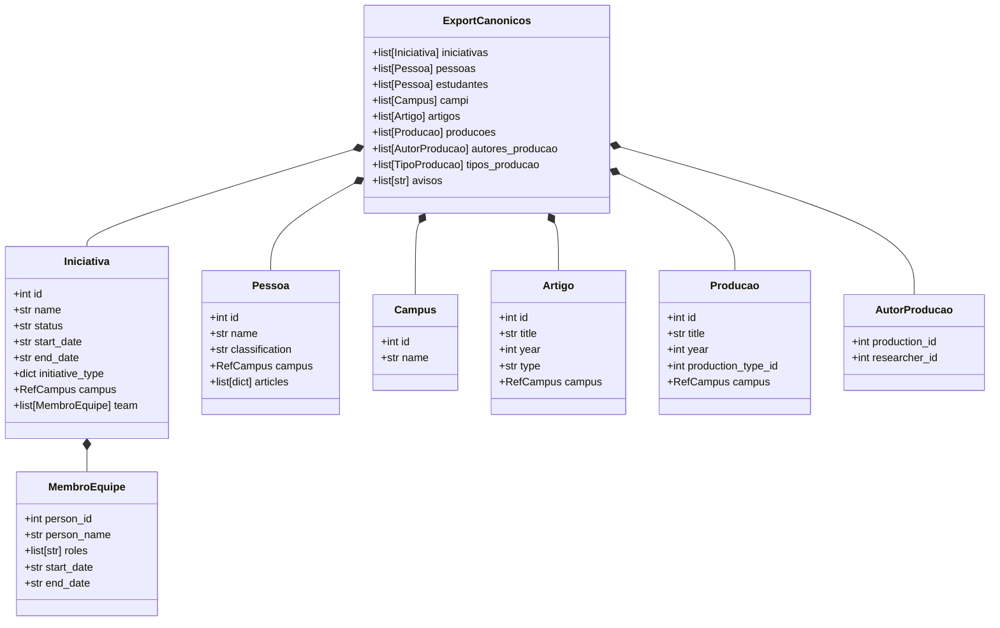
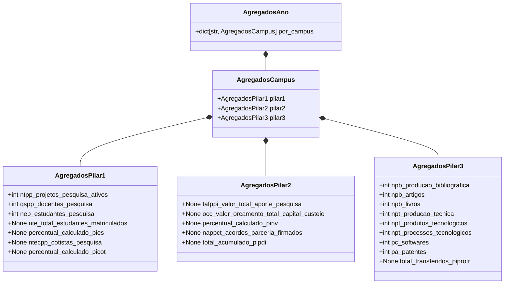

# Data Model: Python Hexagonal ETL Pipeline

**Feature Branch**: `008-python-hexagonal-etl`  
**Date**: 2026-09-25  
**Spec Reference**: [spec.md](./spec.md)

This document formalizes the canonical data entities, domain objects, intermediate aggregates, and sink delivery structures implemented in `etl/core/logic/models.py`.

---

## 1. Input Canonical Entities (Ports / Ingestion)

These entities represent records extracted from `exports_canonical.zip` via `ZipCanonicalSource`.

### Entity Specifications

#### `Iniciativa`

- **Fields**:
  - `id: int`: Unique identifier from SIGPESQ/canonical export.
  - `name: str`: Project title.
  - `status: str | None`: Status description (e.g., "EM_EXECUCAO", "CONCLUIDO").
  - `start_date: str | None`: ISO date `YYYY-MM-DD` or `YYYY-MM-DDTHH:MM:SS`.
  - `end_date: str | None`: ISO date or `None` if ongoing.
  - `initiative_type: dict[str, Any] | None`: Object containing `{"id": int, "name": str}`.
  - `campus: RefCampus | None`: Directly assigned campus.
  - `team: list[MembroEquipe]`: List of team participants.
- **Validation Rules**:
  - If `start_date` is missing or invalid, the initiative is considered never active (`AVISO: iniciativa {id} sem start_date — tratada como nunca ativa`).

#### `Pessoa`

- **Fields**:
  - `id: int`: Unique identifier.
  - `name: str`: Person's name (never exported to public indicator JSONs - Principle IV).
  - `classification: str | None`: Institutional role ("researcher", "student", etc.).
  - `campus: RefCampus | None`: Associated campus.
  - `articles: list[dict[str, Any]] | None`: Optional list of publication references.
- **Validation Rules**:
  - Researchers from `researchers_canonical.json` take precedence over students from `students_canonical.json` upon ID collisions.

#### `Campus`

- **Fields**:
  - `id: int`: Numeric ID (e.g. 1 to 23).
  - `name: str`: Official name (e.g., "Serra", "Vitória", "Cariacica").
- **Slug Generation**:
  - Normalized ASCII lowercase string without accents or spaces (e.g., "Vitória" → "vitoria", "Vila Velha" → "vilavelha").
  - Institutional consolidated slug is `"todos"`.

---

## 2. Core Domain Logic & Resolvers

### Campus Resolution Logic (`CampusResolver`)

Resolves an initiative to its owning campus via a 3-tier hierarchy:

1. **Tier 1 (Direct)**: Declared `iniciativa.campus`.
2. **Tier 2 (Coordinator)**: Campus of the team member with role matching "Coordenador" / "Coordinator".
3. **Tier 3 (First Team Member)**: Campus of the first team member who possesses an associated campus.
4. **Fallback**: If unresolvable, the initiative is not assigned to any individual campus, but is counted in the institutional aggregate `todos` (emitting a warning if active during target years).

### Activity Filter (`ActivityFilter`)

Evaluates whether an entity (initiative or membership) was active during target calendar year `Y` (2024, 2025, 2026):
$$\text{Ativo}(Y) \iff \text{start\_date} \le \text{31/12/}Y \land (\text{end\_date is None} \lor \text{end\_date} \ge \text{01/01/}Y)$$

---

## 3. Domain Aggregates

Pure calculation records computed by `Pillar1Calculator`, `Pillar2Calculator`, and `Pillar3Calculator`.

---

## 4. Delivery & Output Models (Sinks)

### `RegistroPilarJson`

- `nome: str`: File name adhering to pattern `pilar{N}_{campus}_{year}.json` (e.g. `pilar1_serra_2026.json`).
- `conteudo: str`: UTF-8 serialized JSON string.

### Output JSON Structure Specification

#### Header Fields (Common to Pilares 1, 2, 3)

- `campus: str`: Official campus name (or "Todos os Campi").
- `ano_referencia: int`: Reference year (e.g., 2026).
- `pilar: str`:
  - Pilar 1: `"Engajamento Academico e Inclusao"`
  - Pilar 2: `"Fomento e Conexao com o Ecossistema"`
  - Pilar 3: `"Produtividade e Propriedade Intelectual"`
- `indicadores: dict[str, IndicadorDetalhe]`

#### Indicator Schema (`IndicadorDetalhe`)

- `descricao: str`: Human-readable description.
- Metric values: Integers for collected/calculated counts, `null` for uncollected census/budget indicators.
- In Pilar 3, includes `valores_totais_por_tipo: dict[str, int]`.

---

## 5. Invariants & Data Integrity Rules

1. **Principle III Fidelity**: Uncollected indicators (`NTE`, `PIES`, `PICOT`, `TAFPPI`, `PINV`, `PIPDI`, `PIPROTR`) MUST NEVER be set to `0` or estimated; they must strictly serialize as `null`.
2. **Principle IV LGPD Privacy**: No personal names, identification numbers, CPF, email, or individual publication lists may appear in `RegistroPilarJson`.
3. **Idempotence**: Running the ETL pipeline multiple times against the same `exports_canonical.zip` must yield identical, bitwise-reproducible zip bytes.
