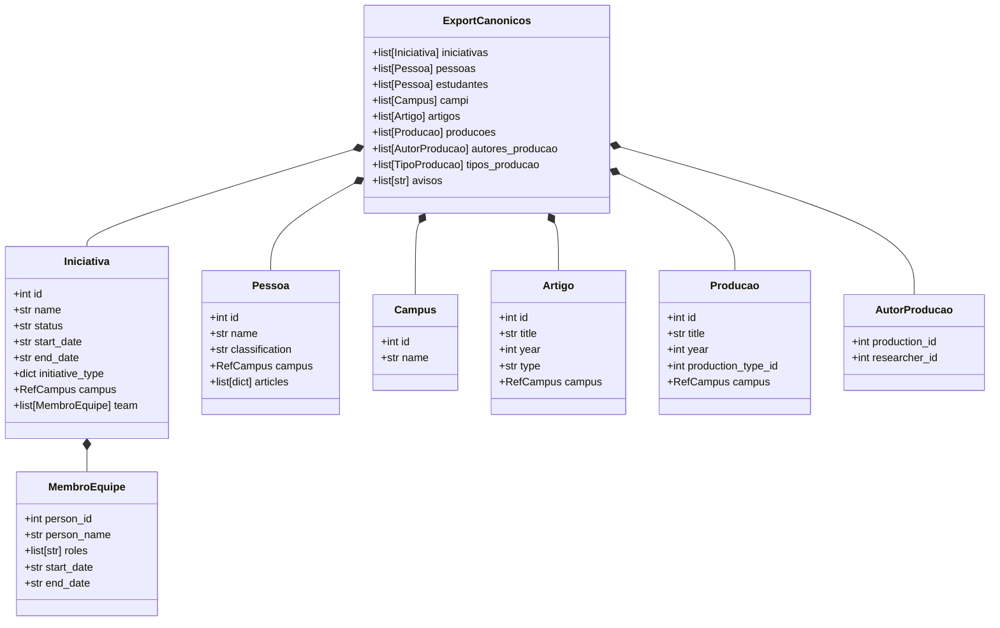
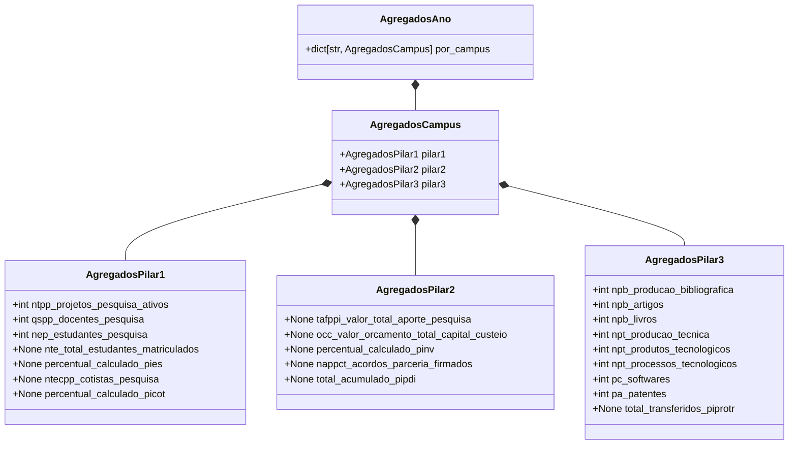

# Modelo de Dados: Pipeline ETL Python (Hexagonal / Ports & Adapters)

**Feature Branch**: `008-python-hexagonal-etl`  
**Date**: 2026-09-25  
**Spec Reference**: [spec.md](./spec.md)

Este documento formaliza as entidades de dados canônicas, os objetos de domínio, os agregados intermediários e as estruturas de entrega do sink implementadas em `etl/core/logic/models.py`.

---

## 1. Entidades Canônicas de Entrada (Portas / Ingestão)

Estas entidades representam registros extraídos de `exports_canonical.zip` via `ZipCanonicalSource`.

### Especificação das Entidades

#### `Iniciativa`

- **Campos**:
  - `id: int`: Identificador único do SIGPESQ/export canônico.
  - `name: str`: Título do projeto.
  - `status: str | None`: Descrição do status (ex.: "EM_EXECUCAO", "CONCLUIDO").
  - `start_date: str | None`: Data ISO `YYYY-MM-DD` ou `YYYY-MM-DDTHH:MM:SS`.
  - `end_date: str | None`: Data ISO ou `None` se em andamento.
  - `initiative_type: dict[str, Any] | None`: Objeto contendo `{"id": int, "name": str}`.
  - `campus: RefCampus | None`: Campus atribuído diretamente.
  - `team: list[MembroEquipe]`: Lista de participantes da equipe.
- **Regras de Validação**:
  - Se `start_date` estiver ausente ou for inválida, a iniciativa é considerada nunca ativa (`AVISO: iniciativa {id} sem start_date — tratada como nunca ativa`).

#### `Pessoa`

- **Campos**:
  - `id: int`: Identificador único.
  - `name: str`: Nome da pessoa (nunca exportado para os JSONs públicos de indicadores — Princípio IV).
  - `classification: str | None`: Papel institucional ("researcher", "student", etc.).
  - `campus: RefCampus | None`: Campus de vínculo.
  - `articles: list[dict[str, Any]] | None`: Lista opcional de referências a publicações.
- **Regras de Validação**:
  - Pesquisadores de `researchers_canonical.json` têm precedência sobre estudantes de `students_canonical.json` em caso de colisão de IDs.

#### `Campus`

- **Campos**:
  - `id: int`: ID numérico (ex.: de 1 a 23).
  - `name: str`: Nome oficial (ex.: "Serra", "Vitória", "Cariacica").
- **Geração de Slug**:
  - String ASCII normalizada em minúsculas, sem acentos nem espaços (ex.: "Vitória" → "vitoria", "Vila Velha" → "vilavelha").
  - O slug do escopo institucional consolidado é `"todos"`.

---

## 2. Lógica de Domínio do Núcleo e Resolvers

### Lógica de Resolução de Campus (`CampusResolver`)

Resolve uma iniciativa ao seu campus de lotação por meio de uma hierarquia de 3 níveis:

1. **Nível 1 (Direto)**: `iniciativa.campus` declarado.
2. **Nível 2 (Coordenador)**: Campus do membro da equipe cujo papel corresponde a "Coordenador" / "Coordinator".
3. **Nível 3 (Primeiro Membro da Equipe)**: Campus do primeiro membro da equipe que possui um campus associado.
4. **Fallback**: Se não for resolvível, a iniciativa não é atribuída a nenhum campus individual, mas é contabilizada no agregado institucional `todos` (emitindo um aviso se estiver ativa nos anos-alvo).

### Filtro de Atividade (`ActivityFilter`)

Avalia se uma entidade (iniciativa ou vínculo) esteve ativa durante o ano civil-alvo `Y` (2024, 2025, 2026):
$$\text{Ativo}(Y) \iff \text{start\_date} \le \text{31/12/}Y \land (\text{end\_date is None} \lor \text{end\_date} \ge \text{01/01/}Y)$$

---

## 3. Agregados de Domínio

Registros de cálculo puros computados por `Pillar1Calculator`, `Pillar2Calculator` e `Pillar3Calculator`.

---

## 4. Modelos de Entrega e Saída (Sinks)

### `RegistroPilarJson`

- `nome: str`: Nome de arquivo em conformidade com o padrão `pilar{N}_{campus}_{year}.json` (ex.: `pilar1_serra_2026.json`).
- `conteudo: str`: String JSON serializada em UTF-8.

### Especificação da Estrutura do JSON de Saída

#### Campos de Cabeçalho (Comuns aos Pilares 1, 2 e 3)

- `campus: str`: Nome oficial do campus (ou "Todos os Campi").
- `ano_referencia: int`: Ano de referência (ex.: 2026).
- `pilar: str`:
  - Pilar 1: `"Engajamento Academico e Inclusao"`
  - Pilar 2: `"Fomento e Conexao com o Ecossistema"`
  - Pilar 3: `"Produtividade e Propriedade Intelectual"`
- `indicadores: dict[str, IndicadorDetalhe]`

#### Schema de Indicador (`IndicadorDetalhe`)

- `descricao: str`: Descrição legível por humanos.
- Valores das métricas: inteiros para contagens coletadas/calculadas, `null` para indicadores de censo/orçamento não coletados.
- No Pilar 3, inclui `valores_totais_por_tipo: dict[str, int]`.

---

## 5. Invariantes e Regras de Integridade de Dados

1. **Fidelidade do Princípio III**: Indicadores não coletados (`NTE`, `PIES`, `PICOT`, `TAFPPI`, `PINV`, `PIPDI`, `PIPROTR`) NUNCA devem ser definidos como `0` nem estimados; devem serializar estritamente como `null`.
2. **Privacidade LGPD do Princípio IV**: Nomes pessoais, números de identificação, CPF, e-mail ou listas individuais de publicações podem NÃO aparecer em `RegistroPilarJson`.
3. **Idempotência**: Executar o pipeline ETL múltiplas vezes sobre o mesmo `exports_canonical.zip` deve produzir bytes de zip idênticos e reprodutíveis bit a bit.
