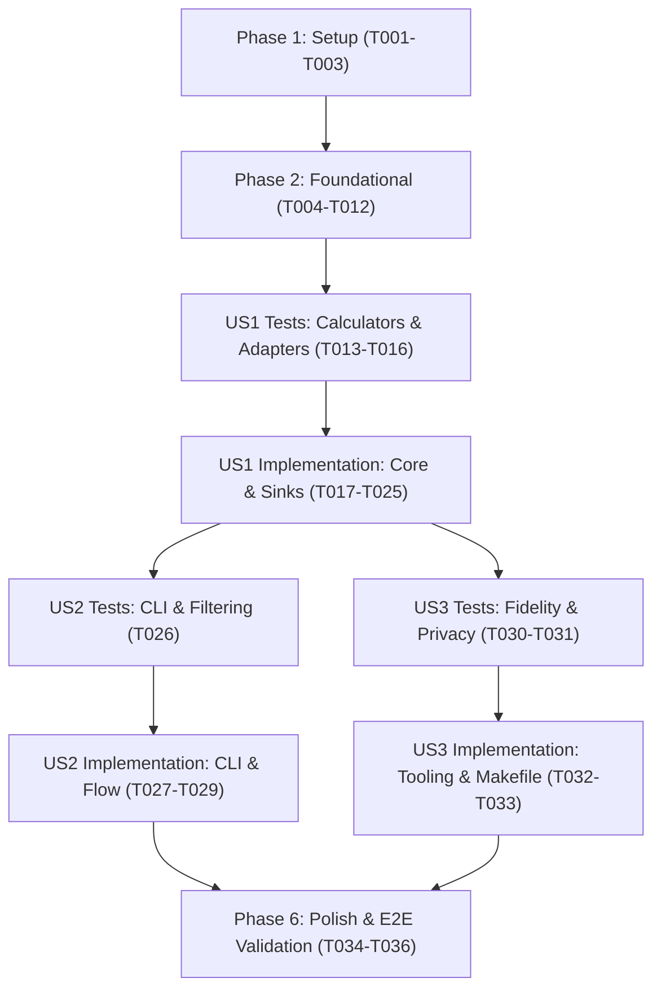

# Tasks: Python Hexagonal ETL Pipeline

**Input**: Design documents from `/specs/008-python-hexagonal-etl/`  
**Prerequisites**: [plan.md](./plan.md) (required), [spec.md](./spec.md) (required for user stories), [research.md](./research.md), [data-model.md](./data-model.md), [contracts/](./contracts/)

**Tests**: Tests are MANDATORY for this project per Constitution Principle II (Test-First Development). Unit and integration tests in `tests/etl/` must be written first and observed to fail before implementing the corresponding logic.

**Organization**: Tasks are grouped by user story to enable independent implementation and testing of each story increment.

---

## Format: `[ID] [P?] [Story] Description`

- **[P]**: Can run in parallel (different files, no dependencies)
- **[Story]**: Which user story this task belongs to (`[US1]`, `[US2]`, `[US3]`)
- Every task includes the exact file path

---

## Phase 1: Setup (Shared Infrastructure)

**Purpose**: Python environment setup, directory scaffolding, and elimination of legacy TypeScript ETL code.

- [x] T001 Initialize Python ETL requirements file in `requirements-etl.txt` with pytest, pytest-cov, black, isort, and flake8
- [x] T002 Create Python module directory structure and `__init__.py` files across `etl/`, `etl/core/`, `etl/core/ports/`, `etl/core/logic/`, `etl/core/logic/resolvers/`, `etl/core/logic/temporal/`, `etl/core/logic/calculators/`, `etl/adapters/`, `etl/adapters/sources/`, `etl/adapters/sinks/`, `etl/flows/`, and `tests/etl/`
- [x] T003 Remove legacy TypeScript ETL files in `src/etl/` and TypeScript tests in `tests/etl/*.test.ts`, and update `"etl"` script in `package.json` to `"python3 -m etl.main"`

---

## Phase 2: Foundational (Blocking Prerequisites)

**Purpose**: Core hexagonal ports, pure domain entities, resolvers, temporal filters, and test fixtures that all user stories depend on.

**⚠️ CRITICAL**: No user story implementation can begin until this foundational phase is complete.

- [x] T004 [P] Define `ISource` abstract base class with `extract() -> ExportCanonicos` in `etl/core/ports/source.py`
- [x] T005 [P] Define `ISink` abstract base class with `load(arquivos: list[RegistroPilarJson]) -> None` in `etl/core/ports/sink.py`
- [x] T006 [P] Implement core canonical dataclasses and domain entities in `etl/core/logic/models.py`
- [x] T007 [P] Implement temporal calendar year activity filter in `etl/core/logic/temporal/activity_filter.py`
- [x] T008 [P] Implement hierarchical campus resolver (declared -> coordinator -> team member) in `etl/core/logic/resolvers/campus_resolver.py`
- [x] T009 [P] Implement unified people registry and collision resolution in `etl/core/logic/resolvers/people_registry.py`
- [x] T010 [P] Implement pytest fixtures and synthetic canonical dataset helpers in `tests/etl/conftest.py`
- [x] T011 [P] Implement unit tests for temporal filter in `tests/etl/test_temporal.py`
- [x] T012 [P] Implement unit tests for campus resolver and people registry in `tests/etl/test_resolvers.py`

**Checkpoint**: Foundation ready — domain models, ports, resolvers, and base tests verified.

---

## Phase 3: User Story 1 - Execução do Pipeline Completo e Geração de Indicadores (Priority: P1) 🎯 MVP

**Goal**: Transform `exports_canonical.zip` into `indicadores.zip` containing all 216 files for 23 campuses and institutional `todos` across years 2024–2026, preserving CONIF formulas and Astro frontend compatibility.

**Independent Test**: Execute `python3 -m etl.main` and verify that `indicadores.zip` is created with 216 valid JSON files matching contract schemas and passing `npm test`.

### Tests for User Story 1 (MANDATORY per Principle II) ⚠️

> **NOTE: Write these tests FIRST and ensure they FAIL before implementing the calculators and sinks**

- [x] T013 [P] [US1] Implement unit tests for Pillar 1, Pillar 2, and Pillar 3 calculators in `tests/etl/test_calculators.py`
- [x] T014 [P] [US1] Implement unit tests for multi-campus aggregation and institutional 'todos' deduplication in `tests/etl/test_aggregator.py`
- [x] T015 [P] [US1] Implement unit tests for `ZipCanonicalSource`, `JsonPilarSink`, and `ZipIndicadoresSink` in `tests/etl/test_adapters.py`
- [x] T016 [P] [US1] Implement integration test for complete execution pipeline in `tests/etl/test_flow.py`

### Implementation for User Story 1

- [x] T017 [P] [US1] Implement Pillar 1 metrics calculator (NTPP, QSPP, NEP, nulls for census) in `etl/core/logic/calculators/pillar1.py`
- [x] T018 [P] [US1] Implement Pillar 2 metrics calculator (strict nulls for PINV and PIPDI) in `etl/core/logic/calculators/pillar2.py`
- [x] T019 [P] [US1] Implement Pillar 3 metrics calculator (NPB, NPT, PC softwares, PA=0) in `etl/core/logic/calculators/pillar3.py`
- [x] T020 [US1] Implement multi-campus and institutional aggregator in `etl/core/logic/calculators/aggregator.py`
- [x] T021 [P] [US1] Implement canonical zip source adapter validating 8 mandatory canonical files in `etl/adapters/sources/zip_canonical_source.py`
- [x] T022 [P] [US1] Implement JSON indicator serialization sink adhering to contract schemas in `etl/adapters/sinks/json_pilar_sink.py`
- [x] T023 [US1] Implement deterministic atomic ZIP persistence sink with contract validation in `etl/adapters/sinks/zip_indicadores_sink.py`
- [x] T024 [US1] Implement pipeline orchestrator flow connecting source, core, and sink in `etl/flows/indicadores_flow.py`
- [x] T025 [US1] Implement CLI runner entrypoint in `etl/main.py` supporting default input/output paths

**Checkpoint**: User Story 1 is complete. Executing `python3 -m etl.main` generates `indicadores.zip` with 216 files compatible with the Astro dashboard.

---

## Phase 4: User Story 2 - Execução Filtrada por Campus Individual com Saída Isolada (Priority: P2)

**Goal**: Allow filtering pipeline execution by a single campus (e.g. `--campus Serra`) and directing output to a dedicated ZIP file (e.g. `indicadores_serra.zip`) containing 9 files without touching `indicadores.zip`.

**Independent Test**: Execute `python3 -m etl.main --campus Serra --saida indicadores_serra.zip` and verify that `indicadores_serra.zip` contains 9 files and `indicadores.zip` remains untouched.

### Tests for User Story 2 (MANDATORY per Principle II) ⚠️

> **NOTE: Write these tests FIRST and ensure they FAIL before implementing CLI options**

- [x] T026 [P] [US2] Implement tests for CLI argument parsing, campus normalization (case/accent insensitivity), and custom output routing in `tests/etl/test_cli.py`

### Implementation for User Story 2

- [x] T027 [US2] Extend `etl/core/logic/calculators/aggregator.py` and `etl/flows/indicadores_flow.py` to support filtered single-campus scope
- [x] T028 [US2] Implement full argument parsing (`--campus`, `--entrada`, `--saida`, `--anos`), environment variable resolution, and exit codes in `etl/main.py`
- [x] T029 [US2] Update `Makefile` target `etl-campus` to execute `python3 -m etl.main` with `--campus` and dedicated `--saida`

**Checkpoint**: User Story 2 complete. Individual campus filtering and dedicated output packages functional and tested.

---

## Phase 5: User Story 3 - Qualidade, Testabilidade e Conformidade (Priority: P3)

**Goal**: Enforce Python code quality tooling (`pytest`, `black`, `isort`, `flake8`) alongside Astro frontend tooling (`eslint`, `prettier`, `vitest`) with unified `Makefile` automation and CI checks.

**Independent Test**: Run `make check` and verify that linting, formatting check, pytest, and vitest all pass with zero errors.

### Tests for User Story 3 (MANDATORY per Principle II) ⚠️

- [x] T030 [P] [US3] Implement schema contract fidelity test in `tests/etl/test_fidelity.py`
- [x] T031 [P] [US3] Implement LGPD privacy verification test in `tests/etl/test_privacy.py`

### Implementation for User Story 3

- [x] T032 [P] [US3] Configure linting and formatting rules for Python in `setup.cfg`
- [x] T033 [US3] Update `Makefile` automation targets (`etl`, `etl-campus`, `test-etl`, `lint`, `format`, `format-check`, `check`) with Python virtual environment detection

**Checkpoint**: User Story 3 complete. Full suite of quality tools integrated and unified in `Makefile`.

---

## Phase 6: Polish & Cross-Cutting Concerns

**Purpose**: Final end-to-end verification, performance check, and system integration.

- [x] T034 Execute end-to-end verification running `make etl` and validating `indicadores.zip` generation in < 5 seconds
- [x] T035 Execute full Astro test suite `npm test` and build `npm run build` verifying complete frontend compatibility
- [x] T036 Execute unified validation `make check` confirming 100% compliance across Python and TypeScript layers

---

## Dependencies & Execution Order

### Parallel Opportunities

- **Phase 2 (Foundational)**:
  - T004 (`source.py`), T005 (`sink.py`), T006 (`models.py`), T007 (`activity_filter.py`), T008 (`campus_resolver.py`), T009 (`people_registry.py`) can be implemented in parallel.
  - T010 (`conftest.py`), T011 (`test_temporal.py`), T012 (`test_resolvers.py`) can be implemented in parallel.
- **Phase 3 (User Story 1)**:
  - Tests T013 (`test_calculators.py`), T014 (`test_aggregator.py`), T015 (`test_adapters.py`), T016 (`test_flow.py`) can be written in parallel.
  - Calculators T017 (`pillar1.py`), T018 (`pillar2.py`), T019 (`pillar3.py`) can be implemented in parallel.
  - Adapters T021 (`zip_canonical_source.py`) and T022 (`json_pilar_sink.py`) can be implemented in parallel.
- **Phase 5 (User Story 3)**:
  - T030 (`test_fidelity.py`), T031 (`test_privacy.py`), and T032 (`setup.cfg`) can run in parallel.

---

## Implementation Strategy

1. **MVP (Minimal Viable Product)**:
   - Complete Phase 1 (Setup) and Phase 2 (Foundational).
   - Complete Phase 3 (User Story 1): Test-driven development of calculators, source, sinks, and flow.
   - Run `python3 -m etl.main` and verify that `indicadores.zip` is generated and compatible with Astro.
2. **Incremental Enhancements**:
   - Deliver User Story 2: add CLI arguments, single-campus filtering, and dedicated output zip.
   - Deliver User Story 3: integrate `pytest`, `black`, `isort`, `flake8` with `Makefile` and enforce CI quality gates.
3. **Final Verification**:
   - Run `make check`, `npm test`, and `npm run build` to confirm zero regressions.
