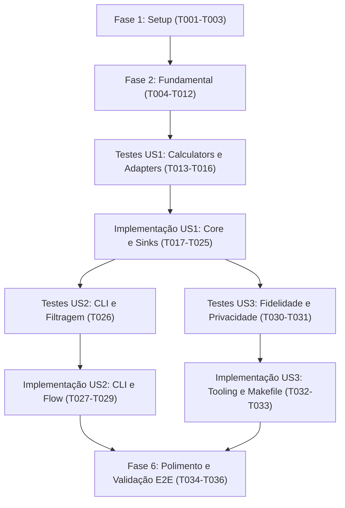

# Tarefas: Pipeline ETL Python (Hexagonal / Ports & Adapters)

**Input**: Documentos de design de `/specs/008-python-hexagonal-etl/`  
**Prerequisites**: [plan.md](./plan.md) (obrigatório), [spec.md](./spec.md) (obrigatório para as histórias de usuário), [research.md](./research.md), [data-model.md](./data-model.md), [contracts/](./contracts/)

**Tests**: Os testes são OBRIGATÓRIOS para este projeto conforme o Princípio II da Constituição (Desenvolvimento Orientado por Testes). Os testes unitários e de integração em `tests/etl/` devem ser escritos primeiro e observados falhando antes da implementação da lógica correspondente.

**Organization**: As tarefas são agrupadas por história de usuário para permitir a implementação e os testes independentes de cada incremento.

---

## Format: `[ID] [P?] [Story] Description`

- **[P]**: Pode ser executada em paralelo (arquivos distintos, sem dependências)
- **[Story]**: A qual história de usuário esta tarefa pertence (`[US1]`, `[US2]`, `[US3]`)
- Cada tarefa inclui o caminho exato do arquivo

---

## Fase 1: Setup (Infraestrutura Compartilhada)

**Purpose**: Configuração do ambiente Python, criação da estrutura de diretórios e eliminação do código ETL legado em TypeScript.

- [x] T001 Inicializar o arquivo de requisitos Python do ETL em `requirements-etl.txt` com pytest, pytest-cov, black, isort e flake8
- [x] T002 Criar a estrutura de diretórios de módulos Python e os arquivos `__init__.py` em `etl/`, `etl/core/`, `etl/core/ports/`, `etl/core/logic/`, `etl/core/logic/resolvers/`, `etl/core/logic/temporal/`, `etl/core/logic/calculators/`, `etl/adapters/`, `etl/adapters/sources/`, `etl/adapters/sinks/`, `etl/flows/` e `tests/etl/`
- [x] T003 Remover os arquivos legados do ETL em TypeScript em `src/etl/` e os testes TypeScript em `tests/etl/*.test.ts`, e atualizar o script `"etl"` em `package.json` para `"python3 -m etl.main"`

---

## Fase 2: Fundamental (Pré-requisitos Bloqueantes)

**Purpose**: Portas hexagonais do núcleo, entidades de domínio puras, resolvers, filtros temporais e fixtures de teste, dos quais dependem todas as histórias de usuário.

**⚠️ CRÍTICO**: Nenhuma implementação de história de usuário pode começar antes que esta fase fundamental esteja completa.

- [x] T004 [P] Definir a classe base abstrata `ISource` com `extract() -> ExportCanonicos` em `etl/core/ports/source.py`
- [x] T005 [P] Definir a classe base abstrata `ISink` com `load(arquivos: list[RegistroPilarJson]) -> None` em `etl/core/ports/sink.py`
- [x] T006 [P] Implementar os dataclasses canônicos do núcleo e as entidades de domínio em `etl/core/logic/models.py`
- [x] T007 [P] Implementar o filtro de atividade por ano civil em `etl/core/logic/temporal/activity_filter.py`
- [x] T008 [P] Implementar o resolver hierárquico de campus (declarado -> coordenador -> membro da equipe) em `etl/core/logic/resolvers/campus_resolver.py`
- [x] T009 [P] Implementar o registro unificado de pessoas e a resolução de colisões em `etl/core/logic/resolvers/people_registry.py`
- [x] T010 [P] Implementar as fixtures do pytest e os auxiliares de dataset canônico sintético em `tests/etl/conftest.py`
- [x] T011 [P] Implementar os testes unitários do filtro temporal em `tests/etl/test_temporal.py`
- [x] T012 [P] Implementar os testes unitários do resolver de campus e do registro de pessoas em `tests/etl/test_resolvers.py`

**Checkpoint**: Fundação pronta — modelos de domínio, portas, resolvers e testes básicos verificados.

---

## Fase 3: User Story 1 - Execução do Pipeline Completo e Geração de Indicadores (Priority: P1) 🎯 MVP

**Goal**: Transformar `exports_canonical.zip` em `indicadores.zip` contendo os arquivos `pilar{N}_{campus}_{year}.json` dos campi do export e do escopo institucional `todos` nos anos 2024–2026 (quantidade variável, derivada do export), preservando as fórmulas CONIF e a compatibilidade com o frontend Astro.

**Independent Test**: Executar `python3 -m etl.main` e verificar que `indicadores.zip` é criado com os arquivos JSON `pilar{N}_{campus}_{year}.json` válidos (quantidade variável, derivada do export), em conformidade com os schemas de contrato e passando em `npm test`.

### Testes para a User Story 1 (OBRIGATÓRIO conforme o Princípio II) ⚠️

> **NOTA: Escreva estes testes PRIMEIRO e garanta que eles FALHAM antes de implementar os calculators e os sinks**

- [x] T013 [P] [US1] Implementar os testes unitários dos calculators dos Pilares 1, 2 e 3 em `tests/etl/test_calculators.py`
- [x] T014 [P] [US1] Implementar os testes unitários da agregação multi-campus e da deduplicação institucional 'todos' em `tests/etl/test_aggregator.py`
- [x] T015 [P] [US1] Implementar os testes unitários de `ZipCanonicalSource`, `JsonPilarSink` e `ZipIndicadoresSink` em `tests/etl/test_adapters.py`
- [x] T016 [P] [US1] Implementar o teste de integração da execução completa do pipeline em `tests/etl/test_flow.py`

### Implementação da User Story 1

- [x] T017 [P] [US1] Implementar o calculator de métricas do Pilar 1 (NTPP, QSPP, NEP, nulos para o censo) em `etl/core/logic/calculators/pillar1.py`
- [x] T018 [P] [US1] Implementar o calculator de métricas do Pilar 2 (nulos estritos para PINV e PIPDI) em `etl/core/logic/calculators/pillar2.py`
- [x] T019 [P] [US1] Implementar o calculator de métricas do Pilar 3 (NPB, NPT, PC de softwares, PA=0) em `etl/core/logic/calculators/pillar3.py`
- [x] T020 [US1] Implementar o agregador multi-campus e institucional em `etl/core/logic/calculators/aggregator.py`
- [x] T021 [P] [US1] Implementar o adaptador de fonte ZIP canônico validando os 8 arquivos canônicos obrigatórios em `etl/adapters/sources/zip_canonical_source.py`
- [x] T022 [P] [US1] Implementar o sink de serialização JSON de indicadores em conformidade com os schemas de contrato em `etl/adapters/sinks/json_pilar_sink.py`
- [x] T023 [US1] Implementar o sink de persistência ZIP atômico determinístico com validação de contrato em `etl/adapters/sinks/zip_indicadores_sink.py`
- [x] T024 [US1] Implementar o flow orquestrador do pipeline conectando source, core e sink em `etl/flows/indicadores_flow.py`
- [x] T025 [US1] Implementar o entrypoint da CLI em `etl/main.py` com suporte a caminhos de entrada/saída padrão

**Checkpoint**: User Story 1 concluída. Executar `python3 -m etl.main` gera `indicadores.zip` com os arquivos `pilar{N}_{campus}_{year}.json` compatíveis com o dashboard Astro.

---

## Fase 4: User Story 2 - Execução Filtrada por Campus Individual com Saída Isolada (Priority: P2)

**Goal**: Permitir filtrar a execução do pipeline por um único campus (por exemplo, `--campus Serra`) e direcionar a saída para um arquivo ZIP dedicado (por exemplo, `indicadores_serra.zip`) contendo 9 arquivos, sem alterar `indicadores.zip`.

**Independent Test**: Executar `python3 -m etl.main --campus Serra --saida indicadores_serra.zip` e verificar que `indicadores_serra.zip` contém 9 arquivos e que `indicadores.zip` permanece intacto.

### Testes para a User Story 2 (OBRIGATÓRIO conforme o Princípio II) ⚠️

> **NOTA: Escreva estes testes PRIMEIRO e garanta que eles FALHAM antes de implementar as opções da CLI**

- [x] T026 [P] [US2] Implementar os testes de parsing de argumentos da CLI, normalização de campus (insensibilidade a maiúsculas/minúsculas e acentuação) e roteamento de saída customizado em `tests/etl/test_cli.py`

### Implementação da User Story 2

- [x] T027 [US2] Estender `etl/core/logic/calculators/aggregator.py` e `etl/flows/indicadores_flow.py` para suportar o escopo filtrado de campus único
- [x] T028 [US2] Implementar o parsing completo de argumentos (`--campus`, `--entrada`, `--saida`, `--anos`), a resolução de variáveis de ambiente e os códigos de saída em `etl/main.py`
- [x] T029 [US2] Atualizar o alvo `etl-campus` do `Makefile` para executar `python3 -m etl.main` com `--campus` e um `--saida` dedicado

**Checkpoint**: User Story 2 concluída. Filtragem por campus individual e pacotes de saída dedicados funcionais e testados.

---

## Fase 5: User Story 3 - Qualidade, Testabilidade e Conformidade (Priority: P3)

**Goal**: Impôr as ferramentas de qualidade de código Python (`pytest`, `black`, `isort`, `flake8`) em conjunto com as ferramentas do frontend Astro (`eslint`, `prettier`, `vitest`), com automação unificada no `Makefile` e verificações de CI.

**Independent Test**: Executar `make check` e verificar que o lint, a checagem de formatação, o pytest e o vitest passam sem erros.

### Testes para a User Story 3 (OBRIGATÓRIO conforme o Princípio II) ⚠️

- [x] T030 [P] [US3] Implementar o teste de fidelidade ao contrato de schema em `tests/etl/test_fidelity.py`
- [x] T031 [P] [US3] Implementar o teste de verificação de privacidade LGPD em `tests/etl/test_privacy.py`

### Implementação da User Story 3

- [x] T032 [P] [US3] Configurar as regras de lint e formatação para Python em `setup.cfg`
- [x] T033 [US3] Atualizar os alvos de automação do `Makefile` (`etl`, `etl-campus`, `test-etl`, `lint`, `format`, `format-check`, `check`) com detecção de ambiente virtual Python

**Checkpoint**: User Story 3 concluída. Suíte completa de ferramentas de qualidade integrada e unificada no `Makefile`.

---

## Fase 6: Polimento & Preocupações Transversais

**Purpose**: Verificação final ponta a ponta, checagem de performance e integração do sistema.

- [x] T034 Executar a verificação ponta a ponta rodando `make etl` e validando a geração de `indicadores.zip` em menos de 5 segundos
- [x] T035 Executar a suíte completa de testes Astro `npm test` e o build `npm run build` verificando a compatibilidade total do frontend
- [x] T036 Executar a validação unificada `make check` confirmando 100% de conformidade nas camadas Python e TypeScript

---

## Dependências & Ordem de Execução

### Oportunidades de Paralelismo

- **Fase 2 (Fundamental)**:
  - T004 (`source.py`), T005 (`sink.py`), T006 (`models.py`), T007 (`activity_filter.py`), T008 (`campus_resolver.py`), T009 (`people_registry.py`) podem ser implementadas em paralelo.
  - T010 (`conftest.py`), T011 (`test_temporal.py`), T012 (`test_resolvers.py`) podem ser implementadas em paralelo.
- **Fase 3 (User Story 1)**:
  - Os testes T013 (`test_calculators.py`), T014 (`test_aggregator.py`), T015 (`test_adapters.py`), T016 (`test_flow.py`) podem ser escritos em paralelo.
  - Os calculators T017 (`pillar1.py`), T018 (`pillar2.py`), T019 (`pillar3.py`) podem ser implementados em paralelo.
  - Os adaptadores T021 (`zip_canonical_source.py`) e T022 (`json_pilar_sink.py`) podem ser implementados em paralelo.
- **Fase 5 (User Story 3)**:
  - T030 (`test_fidelity.py`), T031 (`test_privacy.py`) e T032 (`setup.cfg`) podem ser executadas em paralelo.

---

## Estratégia de Implementação

1. **MVP (Produto Mínimo Viável)**:
   - Concluir a Fase 1 (Setup) e a Fase 2 (Fundamental).
   - Concluir a Fase 3 (User Story 1): desenvolvimento orientado por testes dos calculators, source, sinks e flow.
   - Executar `python3 -m etl.main` e verificar que `indicadores.zip` é gerado e compatível com o Astro.
2. **Melhorias Incrementais**:
   - Entregar a User Story 2: adicionar argumentos de CLI, filtragem por campus único e ZIP de saída dedicado.
   - Entregar a User Story 3: integrar `pytest`, `black`, `isort`, `flake8` ao `Makefile` e impor os portões de qualidade no CI.
3. **Verificação Final**:
   - Executar `make check`, `npm test` e `npm run build` para confirmar zero regressões.
