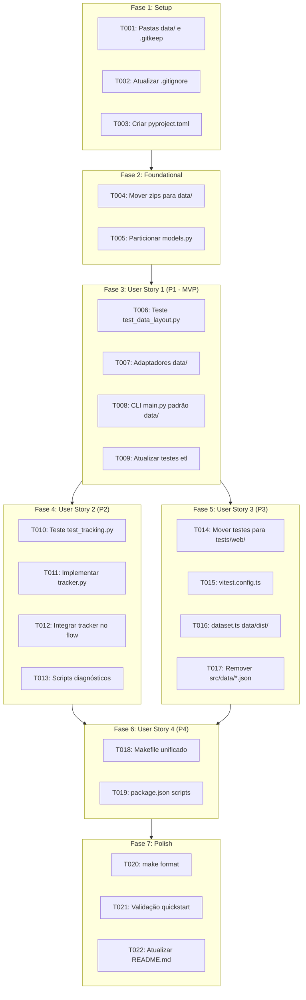

# Tasks: Reorganização Arquitetural Inspirada no Horizon ETL

**Input**: Design documents from `specs/009-reorganize-horizon-architecture/` (`spec.md`, `plan.md`, `research.md`, `data-model.md`, `contracts/`, `quickstart.md`)

**Prerequisites**: `plan.md`, `spec.md`, `data-model.md`, `contracts/`

**Tests**: Testes são OBRIGATÓRIOS conforme o Princípio II da Constituição (Test-First Development). Os testes para cada User Story devem ser escritos e observados a falhar antes da implementação das alterações correspondentes.

**Organization**: Tarefas agrupadas por User Story para possibilitar implementação, testes e entregas independentes e incrementais.

## Format: `- [ ] [ID] [P?] [Story?] Description with file path`

- **[P]**: Tarefas paralelizáveis (arquivos distintos, sem dependência de tarefas anteriores incompletas)
- **[Story]**: Identificador da User Story correspondente (`[US1]`, `[US2]`, `[US3]`, `[US4]`)
- Todos os caminhos de arquivo são explícitos e relativos à raiz do repositório

---

## Phase 1: Setup (Infraestrutura Compartilhada)

**Purpose**: Criação da topologia base de diretórios e governança de arquivos antes de qualquer alteração de código.

- [x] T001 Criar diretórios de governança de dados `data/canonical/`, `data/dist/` e `data/reports/`, adicionando arquivo de preservação em `data/canonical/.gitkeep`
- [x] T002 Atualizar regras de governança e isolamento de binários no `.gitignore` conforme `specs/009-reorganize-horizon-architecture/contracts/data-layout-contract.md`
- [x] T003 [P] Criar arquivo de configuração unificado `pyproject.toml` na raiz com seções para `black`, `isort` e `pytest` (configurando `testpaths = ["tests/etl"]`)

---

## Phase 2: Foundational (Pré-Requisitos Bloqueantes)

**Purpose**: Migração física dos artefatos pesados da raiz e modularização do modelo de dados de domínio.

**⚠️ CRITICAL**: Nenhuma implementação de User Story deve ser iniciada antes da conclusão desta fase.

- [x] T004 Mover com segurança `exports_canonical.zip` da raiz para `data/canonical/exports_canonical.zip` e `indicadores.zip` para `data/dist/indicadores.zip`, limpando a raiz do repositório
- [x] T005 [P] Particionar o modelo monolítico `etl/core/logic/models.py` no pacote modular `etl/core/logic/models/` com os módulos `canonical.py`, `indicators.py`, `export.py` e `__init__.py` conforme `specs/009-reorganize-horizon-architecture/data-model.md`

**Checkpoint**: Camada física de dados isolada e modelos de domínio particionados — início da implementação das User Stories.

---

## Phase 3: User Story 1 - Isolamento e Governança de Dados em Diretório Dedicado (Priority: P1) 🎯 MVP

**Goal**: O pipeline ETL e o comando CLI operam estritamente lendo de `data/canonical/exports_canonical.zip` e gravando em `data/dist/indicadores.zip`, sem interagir com arquivos zip na raiz.

**Independent Test**: Executar `python -m etl.main` e validar que o pacote é gerado em `data/dist/indicadores.zip` com todos os arquivos `pilar{N}_{campus}_{year}.json` derivados do export (quantidade variável), sem recriar nenhum `.zip` na raiz.

### Tests for User Story 1 (MANDATÓRIO per Princípio II) ⚠️

- [x] T006 [P] [US1] Criar teste em `tests/etl/test_data_layout.py` validando resolução do caminho de entrada canônico padrão em `data/canonical/`, geração estrita de saídas em `data/dist/` e mensagem amigável no `stderr` quando o canônico não existir

### Implementation for User Story 1

- [x] T007 [US1] Atualizar `etl/adapters/sources/zip_canonical_source.py` e `etl/adapters/sinks/zip_indicadores_sink.py` para apontar por padrão para `data/canonical/` e `data/dist/`
- [x] T008 [US1] Atualizar o CLI em `etl/main.py` com novos valores padrão de `--entrada` (`data/canonical/exports_canonical.zip`) e `--saida` (`data/dist/indicadores.zip`), adicionando tratamento com mensagem instrutiva quando o arquivo de entrada for ausente conforme `specs/009-reorganize-horizon-architecture/contracts/cli-contract.md`
- [x] T009 [US1] Atualizar asserções de caminhos de arquivos em `tests/etl/test_cli.py` e `tests/etl/test_fidelity.py` para refletirem `data/canonical/` e `data/dist/indicadores.zip`

**Checkpoint**: MVP concluído. A raiz está livre de arquivos `.zip` e o pipeline de ETL opera com governança de dados segregada.

---

## Phase 4: User Story 2 - Pipeline ETL Modular com Tracking e Relatórios de Auditoria (Priority: P2)

**Goal**: Introduzir observabilidade com módulo `etl/tracking/`, geração automática de relatório em `data/reports/etl_run_report.md` sem PII e ferramentas diagnósticas em `etl/scripts/`.

**Independent Test**: Executar `make etl` e inspecionar `data/reports/etl_run_report.md`, confirmando data/hora, volumetria por campus, métricas agregadas e ausência de nomes/CPFs.

### Tests for User Story 2 (MANDATÓRIO per Princípio II) ⚠️

- [x] T010 [P] [US2] Criar teste unitário em `tests/etl/test_tracking.py` validando a coleta de métricas de execução do `ExecutionTracker`, a formatação do relatório Markdown conforme `specs/009-reorganize-horizon-architecture/contracts/report-contract.md` e a conformidade com LGPD (sem PII)

### Implementation for User Story 2

- [x] T011 [US2] Implementar `etl/tracking/tracker.py` com classes `ExecutionMetrics` e `ExecutionTracker` para acumular estatísticas de processamento e gerar o relatório em `data/reports/etl_run_report.md`
- [x] T012 [US2] Integrar `ExecutionTracker` no orquestrador `etl/flows/indicadores_flow.py` para registrar a volumetria de entrada, anomalias e orquestrar a geração do relatório ao término da execução
- [x] T013 [P] [US2] Implementar scripts operacionais e diagnósticos em `etl/scripts/inspect_campuses.py` e `etl/scripts/validate_zip.py` espelhando os utilitários de `horizon_etl/src/scripts/`

**Checkpoint**: Observabilidade completa. Cada execução gera atestado de auditoria persistido e versionável.

---

## Phase 5: User Story 3 - Segregação Estrita de Testes e Desacoplamento do Frontend (Priority: P3)

**Goal**: Segregar todos os testes Vitest em `tests/web/`, atualizar `src/lib/dataset.ts` para ler de `data/dist/indicadores.zip` com fallback seguro, e remover JSONs legados de `src/data/*.json`.

**Independent Test**: Executar `make test-etl` (apenas Pytest passa) e `make test-web` (apenas Vitest passa); executar `npm run build` confirmando geração estática normal.

### Tests for User Story 3 (MANDATÓRIO per Princípio II) ⚠️

- [x] T014 [P] [US3] Mover todos os testes Vitest (`tests/*.test.ts`) e o diretório `tests/helpers/` para `tests/web/`, atualizando caminhos de importação relativa para `../../src/`

### Implementation for User Story 3

- [x] T015 [US3] Atualizar `vitest.config.ts` configurando `include: ['tests/web/**/*.test.ts']` para isolar a execução do Vitest
- [x] T016 [US3] Atualizar `src/lib/dataset.ts` e `tests/web/dataset.test.ts` para carregar por padrão `data/dist/indicadores.zip`, fornecendo aviso orientativo no console caso o pacote não exista conforme `specs/009-reorganize-horizon-architecture/contracts/data-layout-contract.md`
- [x] T017 [US3] Remover os arquivos JSON legados em `src/data/` (`qspp.json`, `ntpp.json`, `picot.json`, `pies.json`), preservando apenas `src/data/indicadores.ts` para metadados e tipagens TypeScript

**Checkpoint**: Frontend desacoplado de mocks duplicados; suítes de testes completamente segregadas e funcionais.

---

## Phase 6: User Story 4 - Padronização do Tooling e Comandos de Desenvolvimento (Priority: P4)

**Goal**: Automação centralizada no `Makefile` e scripts de pacote em `package.json`.

**Independent Test**: Executar `make check` e verificar que todas as etapas (lint, format-check, test-etl, test-web) passam com sucesso e exit code 0.

### Implementation for User Story 4

- [x] T018 [US4] Atualizar `Makefile` com alvos canônicos (`setup`, `etl`, `etl-campus`, `test`, `test-etl`, `test-web`, `lint`, `format`, `format-check`, `check`, `clean`) conforme `specs/009-reorganize-horizon-architecture/contracts/cli-contract.md`
- [x] T019 [US4] Atualizar scripts em `package.json` (`test`, `test:web`, `etl`) para refletir a nova localização dos testes e o comando padrão do pipeline Python

**Checkpoint**: Ferramental unificado e ergonômico para desenvolvedores e integração contínua.

---

## Phase 7: Polish & Cross-Cutting Concerns

**Purpose**: Verificação global, formatação final e documentação.

- [x] T020 [P] Executar `make format` para garantir conformidade estrita de estilo em todo o código Python e TypeScript/Astro
- [x] T021 Executar validação de ponta a ponta seguindo o roteiro de `specs/009-reorganize-horizon-architecture/quickstart.md` (`make etl`, `make check`, `npm run build`), verificando todos os arquivos gerados (quantidade variável) e ausência de zips na raiz
- [x] T022 [P] Atualizar a documentação em `README.md` refletindo a nova arquitetura inspirada no `horizon_etl` (estrutura `data/`, comandos do `Makefile` e segregação de testes)

---

## Dependencies & Execution Graph

---

## Parallel Execution Opportunities

- **Setup**: `T002` e `T003` podem ser executados em paralelo após `T001`.
- **Foundational**: `T004` (movimentação de zips) e `T005` (particionamento de modelos) podem rodar em paralelo.
- **User Story 1**: `T006` (teste) pode ser desenvolvido em paralelo com a preparação de `T007`.
- **User Story 2**: `T010` (teste de tracking) e `T013` (scripts operacionais) podem rodar em paralelo.
- **User Story 3**: `T014` (movimentação de testes) e `T017` (remoção de mocks) podem rodar em paralelo.
- **Polish**: `T020` (formatação) e `T022` (documentação no README) podem rodar em paralelo antes de `T021`.

---

## Implementation Strategy & MVP Recommendation

1. **MVP Scope**: Concluir as Fases 1, 2 e 3 (Tarefas `T001` a `T009`). Ao final do MVP, o repositório já resolve a dor mais urgente apontada: a raiz está livre de arquivos `.zip`, os dados do export (tamanho variável) estão isolados e ignorados em `data/canonical/`, o pacote de saída está em `data/dist/` e o pipeline opera com segurança.
2. **Incremento 2 (Observabilidade & Governança)**: Executar a Fase 4 (`T010` a `T013`), adicionando tracking automático e relatórios de auditoria no estilo do `horizon_etl`.
3. **Incremento 3 (Frontend & Testes)**: Executar a Fase 5 (`T014` a `T017`), limpando a duplicidade de dados em `src/data/` e separando os ambientes de teste.
4. **Incremento 4 (Tooling & Conclusão)**: Executar as Fases 6 e 7 (`T018` a `T022`) para finalizar a automação no `Makefile`, linters e documentação do `README.md`.
