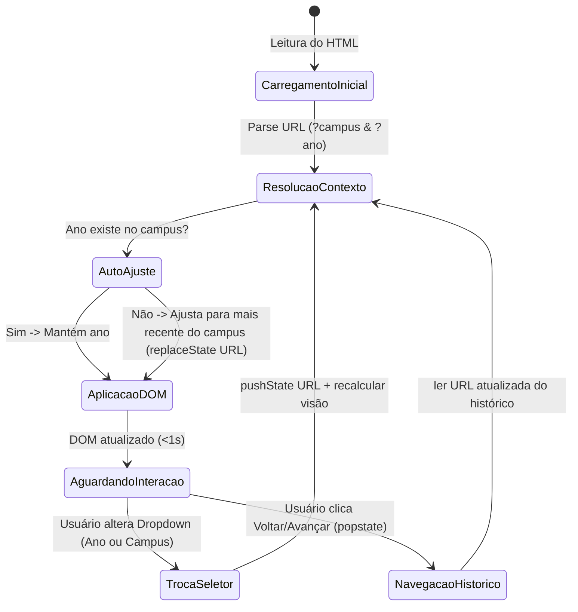

# Data Model: Filtragem Dinâmica de Ano e Campus no Frontend

**Feature**: `013-dynamic-year-campus-filter` | **Date**: 2026-09-30
**Spec**: [spec.md](./spec.md)

Este documento define as entidades de dados utilizadas na camada de cliente e no compartilhamento isomórfico entre o build do Astro e o navegador.

---

## 1. Entidades Principais

### 1.1 ContextoFiltro

Representa o par ativo de seleção que rege a exibição da tela no momento.

```typescript
export interface ContextoFiltro {
  campus: string; // Slug do campus em minúsculas (ex.: "serra", "todos", "vitoria")
  ano: number; // Ano de referência selecionado (ex.: 2024, 2025, 2026)
}
```

- **Regras de Validação:**
  - `campus`: Deve corresponder a um slug presente em `campi` do dataset. Se ausente, nulo ou desconhecido, recai para `'todos'`.
  - `ano`: Deve ser um número inteiro pertencente aos anos disponíveis para o campus selecionado. Se ausente ou inválido, recai para o ano mais recente do campus.
  - **Auto-Ajuste (FR-013):** Se o campus mudar para um que não possui o ano atual, o ano é ajustado para o ano disponível mais próximo (preferencialmente o mais recente).

### 1.2 RegistroEntradaZip & ArquivoPilarRaw

Representa o conteúdo bruto de cada arquivo extraído do pacote de indicadores (ex.: `pilar1_serra_2026.json`).

```typescript
export interface ArquivoPilarRaw {
  campus: string;
  ano_referencia: number;
  pilar: string;
  indicadores: Record<string, Record<string, unknown>>;
}

export interface RegistroEntradaZip {
  pilarNumero: 1 | 2 | 3;
  campusSlug: string;
  campusNome: string;
  ano: number;
  dados: ArquivoPilarRaw;
}

export interface DatasetCompleto {
  campi: CampusInfo[];
  anos: number[];
  entradas: RegistroEntradaZip[];
}

export interface CampusInfo {
  slug: string;
  nome: string;
  anos: number[];
}
```

### 1.3 VisaoMetrica & VisaoIndicador

Estrutura puramente derivada que resume os valores prontos para renderização no DOM para um determinado contexto:

```typescript
export interface VisaoMetrica {
  sigla: string;
  valorFormatado: string; // Ex.: "14", "12,5%", "Dado indisponível"
  unidade?: string; // Ex.: "projetos", "servidores", "%"
  disponivel: boolean; // true se possui valor numérico válido
  deltaFormatado?: string; // Ex.: "+12% em relação a 2025" ou "Sem base anterior"
  deltaPositivo?: boolean | null; // true (positivo), false (negativo), null (neutro/sem base)
  avisoEmAndamento?: string | null; // Mensagem se o ano for ANO_EM_ANDAMENTO
  hrefDetalhe?: string; // URL do indicador preservando ?campus=...&ano=...
}

export interface VisaoPaginaGeral {
  contexto: ContextoFiltro;
  kpis: Record<string, VisaoMetrica>; // NTPP, QSPP, NEP, PIPRO
  pilares: {
    1: VisaoMetrica[]; // NTPP, QSPP, NEP, PIES
    2: VisaoMetrica[]; // PINV, PIPDI
    3: VisaoMetrica[]; // PIPRO, PIPROT, PIPROTR
  };
}

export interface VisaoPaginaDetalhe {
  sigla: string;
  contexto: ContextoFiltro;
  metricaPrincipal: VisaoMetrica;
  componentes: Array<{
    sigla: string;
    nome: string;
    quantidadeFormatada: string;
  }>;
}
```

---

## 2. Transições de Estado



---

## 3. Regras de Negócio e Integridade dos Dados

1. **Prioridade de Resolução de Parâmetros:**
   - URL explícita válida > Padrão do site (`todos` e ano mais recente).
2. **Fidelidade (Princípio III):**
   - Se `valor === null` ou ausente, a representação DEVE ser `"Dado indisponível"`. Nunca `0`, `"-"` ou string vazia.
3. **Cálculo de Variação (Delta):**
   - Comparado estritamente com `ano - 1` do mesmo campus. Se `ano - 1` não tiver dados apurados ou não existir no campus, o delta é `sem_base` ("Sem base anterior").
4. **Ano em Andamento:**
   - Se `ano === ANO_EM_ANDAMENTO` (2026), renderiza badge/aviso informativo de dados parciais.
