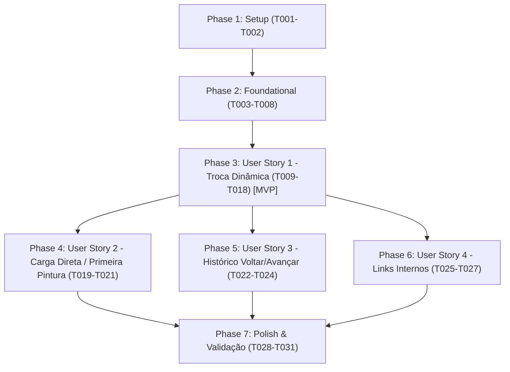

# Tasks: Filtragem Dinâmica de Ano e Campus no Frontend

**Input**: Design documents from `/specs/013-dynamic-year-campus-filter/`
**Prerequisites**: [plan.md](./plan.md) (required), [spec.md](./spec.md) (required), [research.md](./research.md), [data-model.md](./data-model.md), [contracts/](./contracts/), [quickstart.md](./quickstart.md)

**Tests**: Testes são OBRIGATÓRIOS conforme Princípio II da Constituição (Test-First Development). Todas as fases de User Story iniciam com tarefas de teste que DEVEM ser executadas e falhar antes da implementação (red → green → refactor).

**Organization**: Tarefas organizadas por User Story para permitir entrega e testes independentes de cada incremento.

---

## Phase 1: Setup (Infraestrutura Compartilhada)

**Purpose**: Estruturação de fixtures e tipos para suporte ao desenvolvimento e testes.

- [x] T001 [P] Criar fixtures de teste com dataset representativo contendo múltiplos campi e anos em tests/web/fixtures/dataset-sample.ts
- [x] T002 [P] Declarar interfaces e tipos isomórficos compartilhados em src/lib/dataset-core.ts

---

## Phase 2: Foundational (Pré-Requisitos Bloqueantes)

**Purpose**: Núcleo isomórfico puro, resolução de contexto com auto-ajuste e injeção do JSON embarcado.

**⚠️ CRITICAL**: Nenhuma tarefa de User Story pode ser iniciada antes da conclusão desta fase.

- [x] T003 [P] Criar testes unitários (RED) para mapeamento do núcleo puro em tests/web/dataset-core.test.ts
- [x] T004 Implementar núcleo puro isomórfico de extração e mapeamento sem dependências de Node.js em src/lib/dataset-core.ts
- [x] T005 Refatorar src/lib/dataset.ts para delegar a lógica de mapeamento para src/lib/dataset-core.ts
- [x] T006 [P] Criar testes unitários (RED) para resolução de contexto e auto-ajuste de ano por campus (FR-013) em tests/web/contexto.test.ts
- [x] T007 Implementar função pura de resolução de contexto com auto-ajuste de ano mais recente/próximo (FR-013) em src/lib/contexto.ts
- [x] T008 Embutir o dataset completo agregado serializado em tag script type application/json em src/layouts/BaseLayout.astro

**Checkpoint**: Base isomórfica pronta — implementação das User Stories pode iniciar.

---

## Phase 3: User Story 1 - Troca Dinâmica de Ano/Campus na Interface (Priority: P1) 🎯 MVP

**Goal**: Permitir alternar campus e ano pelos seletores do cabeçalho, gaveta ou detalhes atualizando instantaneamente todas as métricas no DOM sem recarregar a página.

**Independent Test**: Abrir a página inicial, trocar o ano no dropdown de 2026 para 2025/2024 e conferir se todos os valores de KPI e pilares mudam imediatamente sem reload.

### Tests for User Story 1 (MANDATÓRIO per Princípio II) ⚠️

- [x] T009 [P] [US1] Criar testes unitários (RED) para cálculo e formatação de visão de métricas por contexto em tests/web/visao.test.ts
- [x] T010 [P] [US1] Criar testes unitários (RED) para aplicação de visão no DOM via atributos data-* em tests/web/aplicar-visao.test.ts

### Implementation for User Story 1

- [x] T011 [US1] Implementar gerador de visão de métricas para visão geral, pilares e detalhe em src/lib/visao.ts
- [x] T012 [US1] Implementar aplicação de visão no DOM com tolerância a nós ausentes em src/lib/aplicar-visao.ts
- [x] T013 [P] [US1] Adicionar atributos semânticos data-kpi-* aos cartões de KPI em src/pages/index.astro
- [x] T014 [P] [US1] Adicionar atributos semânticos data-metrica-* aos itens de métricas em src/components/CartaoPilar.astro
- [x] T015 [P] [US1] Adicionar atributos semânticos data-card-* aos cartões de indicador em src/components/IndicatorCard.astro
- [x] T016 [P] [US1] Adicionar atributos semânticos data-detalhe-* e data-componente-qtd em src/pages/pilar-1/[sigla].astro, src/pages/pilar-2/[sigla].astro e src/pages/pilar-3/[sigla].astro
- [x] T017 [US1] Implementar ouvinte de eventos de seleção sem recarga de página e despacho de atualização do DOM em src/lib/contexto-cliente.ts
- [x] T018 [US1] Atualizar src/layouts/BaseLayout.astro e src/components/YearLinks.astro para usar o despachador de contexto sem window.location.href

**Checkpoint**: Neste ponto, a User Story 1 (MVP) está 100% funcional: a troca de ano/campus atualiza a tela na hora sem reload.

---

## Phase 4: User Story 2 - Carregamento Direto com Parâmetros de URL e Primeira Pintura (Priority: P1)

**Goal**: Garantir que abrir ou recarregar uma URL com ?campus=...&ano=... exiba os valores corretos já na primeira pintura sem exibir dados de 2026.

**Independent Test**: Colar na barra de endereços uma URL com ?campus=serra&ano=2024 e recarregar; verificar que os valores exibidos são de 2024 desde o primeiro instante e os dropdowns estão sincronizados.

### Tests for User Story 2 (MANDATÓRIO per Princípio II) ⚠️

- [x] T019 [P] [US2] Criar testes unitários (RED) para hidratação inicial e leitura de parâmetros na carga da página em tests/web/contexto-url.test.ts

### Implementation for User Story 2

- [x] T020 [US2] Implementar leitura síncrona dos parâmetros da URL e aplicação imediata da visão no carregamento inicial do DOM em src/lib/contexto-cliente.ts
- [x] T021 [US2] Integrar o bootstrap inicial no cabeçalho de src/layouts/BaseLayout.astro evitando flash de dados incorretos na primeira pintura

**Checkpoint**: User Stories 1 e 2 funcionais: links diretos com parâmetros abrem de forma fiel e a troca interativa funciona sem recarga.

---

## Phase 5: User Story 3 - Navegação do Histórico Voltar/Avançar (Priority: P2)

**Goal**: Permitir usar os botões Voltar e Avançar do navegador restaurando o contexto correspondente no DOM, seletores e URL.

**Independent Test**: Alterar o ano duas vezes, clicar em Voltar e verificar que tanto a URL quanto os números da tela retornam ao ano anterior sem recarregar a página.

### Tests for User Story 3 (MANDATÓRIO per Princípio II) ⚠️

- [x] T022 [P] [US3] Criar testes unitários (RED) para captura de popstate e sincronização de estado em tests/web/historico.test.ts

### Implementation for User Story 3

- [x] T023 [US3] Atualizar a URL via history.pushState na troca de seletores em src/lib/contexto-cliente.ts
- [x] T024 [US3] Implementar ouvinte do evento popstate em src/lib/contexto-cliente.ts restaurando a visão e seletores correspondentes

**Checkpoint**: Histórico do navegador totalmente integrado ao fluxo da aplicação.

---

## Phase 6: User Story 4 - Preservação de Contexto em Links Internos (Priority: P2)

**Goal**: Preservar os parâmetros ?campus=...&ano=... em todos os links internos durante a navegação entre páginas.

**Independent Test**: Selecionar um campus e ano na página inicial, clicar em um pilar ou indicador e conferir se a nova página abre com os mesmos parâmetros na URL.

### Tests for User Story 4 (MANDATÓRIO per Princípio II) ⚠️

- [x] T025 [P] [US4] Criar testes unitários (RED) para normalização e sincronização contínua de links internos em tests/web/propagacao-links.test.ts

### Implementation for User Story 4

- [x] T026 [US4] Implementar rotina de reescrita contínua de atributos href em links internos relativos em src/lib/contexto-cliente.ts
- [x] T027 [US4] Atualizar destinos de links em cartões de pilar e cartões de indicador dinamicamente após troca de contexto em src/lib/aplicar-visao.ts

**Checkpoint**: Todas as 4 User Stories estão concluídas e integradas.

---

## Phase 7: Polish & Cross-Cutting Concerns

**Purpose**: Verificação de qualidade, acessibilidade, compatibilidade entre ambientes e documentação.

- [x] T028 [P] Validar acessibilidade e rótulos ARIA dos seletores de cabeçalho e gaveta móvel em src/layouts/BaseLayout.astro
- [x] T029 Executar bateria completa de testes automatizados com npm test e garantir 100% de aprovação
- [x] T030 Executar validação de formatação e lint com npm run lint e npm run format:check garantindo zero erros
- [x] T031 Executar compilação estática npm run build e validar os cenários de testes manuais descritos em specs/013-dynamic-year-campus-filter/quickstart.md via npm run preview

---

## Dependencies & Execution Order

---

## Parallel Execution Opportunities

- **Fase 1**: T001 (fixtures) e T002 (tipos) podem ser desenvolvidos em paralelo.
- **Fase 2**: T003 (testes de dataset-core) e T006 (testes de contexto) podem ser escritos em paralelo.
- **Fase 3**:
  - Testes T009 (visão) e T010 (aplicar-visão) podem ser escritos em paralelo.
  - Marcação de atributos DOM T013 (`index.astro`), T014 (`CartaoPilar.astro`), T015 (`IndicatorCard.astro`) e T016 (`[sigla].astro`) são 100% independentes entre si e podem rodar em paralelo.
- **Fase 7**: T028 (acessibilidade) pode ser validada em paralelo com as revisões de estilo.

---

## Implementation Strategy & MVP

1. **Incremento 1 (MVP - Fases 1 a 3)**:
   - Extrai o núcleo puro e embute o JSON na página.
   - Conecta a troca de dropdown aos atributos `data-*` para atualizar os valores de NTPP, QSPP, NEP, etc., instantaneamente na tela sem recarregar.
   - **Resultado imediato**: O bug central onde tudo ficava travado em 2026 é eliminado.
2. **Incremento 2 (Fase 4)**:
   - Garante que carregar links diretos já traga a visão renderizada sem FOIC.
3. **Incremento 3 (Fases 5 e 6)**:
   - Suporte pleno ao botão Voltar/Avançar e persistência em links internos.
4. **Incremento 4 (Fase 7)**:
   - Validação de build estático, testes finais e CI.
