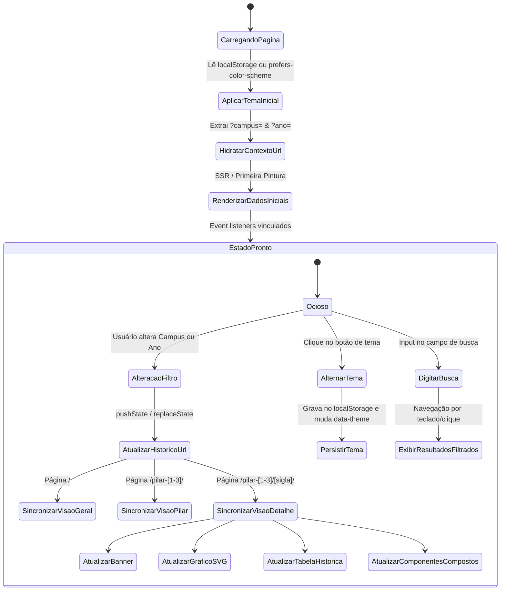

# Data Model: Reformulação e Correção Abrangente do Frontend

**Feature**: `014-frontend-ux-overhaul`
**Date**: 2026-10-01

Este documento descreve os modelos de dados e estruturas de estado em memória que governam o ciclo de vida e a renderização do frontend no navegador.

---

## 1. Entidades de Domínio e Estruturas de Estado

### 1.1 ContextoDeVisualizacao

Representa o estado global de filtragem e seleção ativo na sessão do usuário.

| Campo    | Tipo                            | Descrição                               | Regras de Validação                                                                                                      |
| -------- | ------------------------------- | --------------------------------------- | ------------------------------------------------------------------------------------------------------------------------ |
| `campus` | `string`                        | Slug do campus selecionado ou `'todos'` | Deve pertencer à lista de campi válidos do dataset. Se ausente/inválido, reverte para `'todos'`.                         |
| `ano`    | `number`                        | Ano de referência filtrado              | Deve ser um inteiro de 4 dígitos. Se o campus não possuir dados para o ano, ajusta para o ano mais próximo com apuração. |
| `tema`   | `'claro' \| 'escuro' \| 'auto'` | Preferência de apresentação visual      | Persistido no `localStorage` sob a chave `'indicadores_tema'`. Valor padrão é `'auto'`.                                  |

---

### 1.2 VisaoGraficoDetalhe

Estrutura de dados calculada pelo cliente para atualizar o SVG de série temporal dinamicamente.

| Campo      | Tipo                 | Descrição                                                                                  |
| ---------- | -------------------- | ------------------------------------------------------------------------------------------ |
| `sigla`    | `string`             | Sigla unívoca do indicador (ex: `'NTPP'`)                                                  |
| `campus`   | `string`             | Campus de apuração                                                                         |
| `anoAtivo` | `number`             | Ano atualmente selecionado no filtro                                                       |
| `pontos`   | `PontoGrafico[]`     | Coordenadas cartesianas `(x, y)` calculadas com base nas dimensões do SVG                  |
| `linhaD`   | `string`             | String do atributo `d` do elemento `<path>` SVG (ex: `"M 36.00 120.00 L 150.00 80.00..."`) |
| `escala`   | `EixoEscala \| null` | Valores mínimo, médio e máximo com coordenadas `y` para linhas-guia                        |
| `temDados` | `boolean`            | Indica se existem pelo menos 2 pontos válidos para traçar a linha                          |

```typescript
export interface PontoGraficoDetalhe {
  ano: number;
  valor: number;
  x: number;
  y: number;
  rotuloX: number;
  rotuloY: number;
  textoRotulo: string;
  ativo: boolean; // true se ano === anoAtivo
}
```

---

### 1.3 VisaoHistoricoTabela

Estrutura que alimenta a tabela de série histórica na coluna lateral da página de detalhe.

| Campo    | Tipo               | Descrição                                                  |
| -------- | ------------------ | ---------------------------------------------------------- |
| `sigla`  | `string`           | Sigla do indicador                                         |
| `linhas` | `LinhaHistorico[]` | Coleção de anos ordenados da série histórica para o campus |

```typescript
export interface LinhaHistorico {
  ano: number;
  valorFormatado: string;
  disponivel: boolean;
  motivoIndisponivel?: string;
  ativo: boolean; // destaca a linha correspondente ao ano ativo
}
```

---

### 1.4 ItemBuscaIndicador

Entidade otimizada para o índice de busca rápida no cabeçalho.

| Campo         | Tipo          | Descrição                                                               |
| ------------- | ------------- | ----------------------------------------------------------------------- |
| `sigla`       | `string`      | Sigla do indicador (ex: `"NTPP"`)                                       |
| `nome`        | `string`      | Nome por extenso (ex: `"Número Total de Projetos de Pesquisa"`)         |
| `pilarNumero` | `1 \| 2 \| 3` | Número do pilar de vinculação                                           |
| `pilarNome`   | `string`      | Nome resumido do pilar                                                  |
| `slug`        | `string`      | Identificador de rota URL                                               |
| `termosBusca` | `string`      | String agregada normalizada (sem acentos, minúsculas) para busca rápida |

---

### 1.5 DeltaFormatadoAcessivel

Modelo de representação de tendência anual com suporte estrito a WCAG AA.

| Campo                | Tipo                                                  | Descrição                                                                       |
| -------------------- | ----------------------------------------------------- | ------------------------------------------------------------------------------- |
| `tipo`               | `'positivo' \| 'negativo' \| 'estavel' \| 'sem_base'` | Classificação da evolução                                                       |
| `simbolo`            | `'▲' \| '▼' \| '=' \| ''`                             | Caractere visual obrigatório independente de cor                                |
| `valorFormatado`     | `string`                                              | Texto visível de variação (ex: `"+12,5%"`, `"-3,2%"`, `"0,0%"`)                 |
| `descricaoAcessivel` | `string`                                              | Texto para leitor de tela (ex: `"Aumento de 12,5% em relação ao ano anterior"`) |
| `anoAnterior`        | `number \| null`                                      | Ano base de comparação                                                          |

---

## 2. Diagrama de Transição de Estado do Cliente


