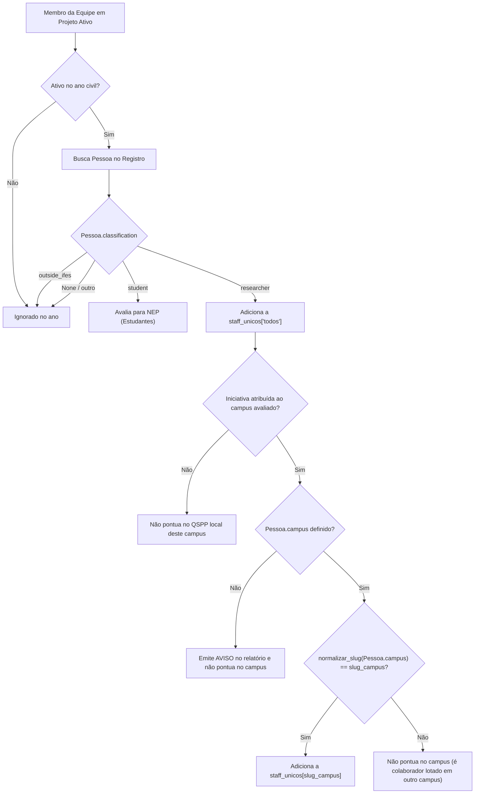

# Data Model: Restrição do QSPP aos Servidores com Lotação no Próprio Campus

**Branch**: `fix/first-pilar` | **Date**: 2026-10-03 | **Spec**: [spec.md](./spec.md)

## Entidades e Atributos Relevantes

### 1. Pessoa (`etl.core.logic.models.Pessoa`)

Representa um indivíduo registrado no repositório canônico do IFES.

| Atributo         | Tipo                 | Descrição                        | Regra de Validação                                                          |
| :--------------- | :------------------- | :------------------------------- | :-------------------------------------------------------------------------- |
| `id`             | `int`                | Identificador único do indivíduo | Inteiro positivo único                                                      |
| `name`           | `str`                | Nome da pessoa                   | Texto não-vazio                                                             |
| `classification` | `str \| None`        | Classificação institucional      | Valores canônicos: `"researcher"`, `"student"`, `"outside_ifes"`, ou `None` |
| `campus`         | `RefCampus \| None`  | Campus de lotação institucional  | Objeto com `id` e `name` do campus oficial                                  |
| `articles`       | `list[dict] \| None` | Artigos publicados pela pessoa   | Lista opcional                                                              |

### 2. MembroEquipe (`etl.core.logic.models.MembroEquipe`)

Representa a atuação de uma pessoa em uma iniciativa com vigência e papéis declarados.

| Atributo      | Tipo          | Descrição                                                                       |
| :------------ | :------------ | :------------------------------------------------------------------------------ |
| `person_id`   | `int`         | Referência à `Pessoa`                                                           |
| `person_name` | `str`         | Nome registrado na equipe                                                       |
| `roles`       | `list[str]`   | Papéis assumidos no projeto (ex.: `"Coordinator"`, `"Researcher"`, `"Student"`) |
| `start_date`  | `str \| None` | Início do vínculo no projeto                                                    |
| `end_date`    | `str \| None` | Término do vínculo no projeto                                                   |

### 3. AgregadosPilar1 (`etl.core.logic.models.AgregadosPilar1`)

Métricas agregadas consolidadas por campus e ano para o Pilar 1.

| Campo                               | Tipo          | Descrição                                               | Regra Nova                                                                                                                        |
| :---------------------------------- | :------------ | :------------------------------------------------------ | :-------------------------------------------------------------------------------------------------------------------------------- |
| `ntpp_projetos_pesquisa_ativos`     | `int`         | Total de projetos de pesquisa ativos                    | Inalterado                                                                                                                        |
| `qspp_docentes_pesquisa`            | `int`         | Total de servidores únicos do campus ativos em pesquisa | **Alterado**: Apenas `classification == 'researcher'` com `pessoa.campus == campus_alvo` (ou qualquer campus no escopo `"todos"`) |
| `nep_estudantes_pesquisa`           | `int`         | Total de discentes únicos ativos em pesquisa            | Inalterado                                                                                                                        |
| `nte_total_estudantes_matriculados` | `int \| None` | Censo escolar de matrículas                             | Inalterado                                                                                                                        |
| `percentual_calculado_pies`         | `int \| None` | Percentual PIES derivado                                | Inalterado                                                                                                                        |
| `ntecpp_cotistas_pesquisa`          | `int \| None` | Discentes cotistas em pesquisa                          | Inalterado                                                                                                                        |
| `percentual_calculado_picot`        | `int \| None` | Percentual PICOT derivado                               | Inalterado                                                                                                                        |

---

## Regras de Associação e Pertinência

