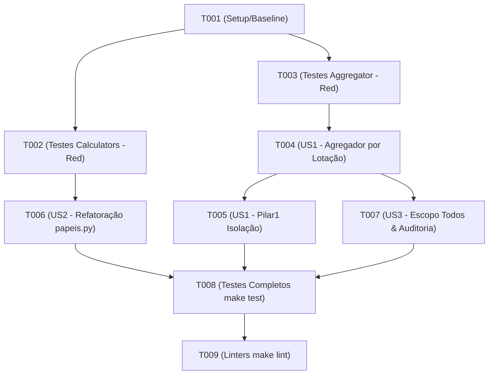

# Tasks: Restrição do QSPP aos Servidores com Lotação no Próprio Campus

**Input**: Design documents from `specs/015-qspp-lotacao-campus/`

**Prerequisites**: `plan.md`, `spec.md`, `research.md`, `data-model.md`, `contracts/`

**Tests**: Testes são MANDATÓRIOS para este projeto (Constituição Princípio II, Test-First Development). Os testes devem ser escritos e observados falhar ANTES da implementação.

**Organization**: Tarefas organizadas por User Story para implementação e validação independentes.

## Format: `[ID] [P?] [Story] Description`

- **[P]**: Paralelizável (arquivos diferentes, sem dependências de tarefas não concluídas)
- **[Story]**: Mapeamento para as histórias de usuário (`[US1]`, `[US2]`, `[US3]`)

---

## Phase 1: Setup (Ambiente e Baseline)

**Purpose**: Verificação do ambiente e baseline dos testes

- [x] T001 Verificar a execução baseline dos testes com `.venv/bin/python -m pytest -q tests/etl` e registrar integridade inicial

---

## Phase 2: Foundational (TDD - Testes Red)

**Purpose**: Criação dos testes unitários e de integração que falharão inicialmente, codificando os novos critérios de aceitação

**⚠️ CRITICAL**: Executar os testes novos antes da implementação e observar o estado RED (falha esperada)

- [x] T002 [P] Escrever testes unitários em `tests/etl/test_calculators.py` validando que `eh_pesquisador_em_pesquisa` rejeita `outside_ifes`, `student` com papéis de projeto e participantes sem classificação
- [x] T003 [P] Escrever testes de agregação em `tests/etl/test_aggregator.py` validando que servidores lotados em outros campi não pontuam no QSPP local de um campus e que apenas servidores com lotação no próprio campus pontuam

---

## Phase 3: User Story 1 - Restrição do QSPP ao Campus de Lotação (Priority: P1) 🎯 MVP

**Goal**: Assegurar que no escopo de um campus individual (ex.: Serra), apenas servidores cujo projeto é sediado no campus E cuja lotação institucional (`pessoa.campus`) seja do próprio campus pontuem no QSPP local.

**Independent Test**: `.venv/bin/python -m pytest tests/etl/test_aggregator.py -k test_qspp_restricao_lotacao_campus` executa e passa.

### Implementation for User Story 1

- [x] T004 [US1] Modificar a lógica de pertinência em `etl/core/logic/calculators/aggregator.py` para exigir correspondência entre `normalizar_slug(pessoa.campus.name)` e o campus avaliado
- [x] T005 [US1] Atualizar `etl/core/logic/calculators/pillar1.py` para sincronizar o cálculo isolado do Pilar 1 com a regra de lotação do pesquisador

**Checkpoint**: User Story 1 funcional e testada independentemente. Servidores de outros campi não mais inflam o QSPP local.

---

## Phase 4: User Story 2 - Exclusão de Colaboradores Externos e Discentes (Priority: P2)

**Goal**: Garantir que pessoas classificadas como `outside_ifes` ou `student` jamais pontuem como servidores no QSPP, eliminando brechas por substring em `roles`.

**Independent Test**: `.venv/bin/python -m pytest tests/etl/test_calculators.py -k test_eh_pesquisador_em_pesquisa` executa e passa.

### Implementation for User Story 2

- [x] T006 [US2] Refatorar `eh_pesquisador_em_pesquisa` em `etl/core/logic/calculators/papeis.py` exigindo estritamente `pessoa is not None and pessoa.classification == "researcher"`

**Checkpoint**: Colaboradores externos e alunos bolsistas expurgados do QSPP.

---

## Phase 5: User Story 3 - Integridade do Escopo Global e Auditoria (Priority: P3)

**Goal**: Garantir que no escopo institucional global `"todos"` todos os servidores únicos do IFES continuam pontuando e gerar avisos informativos para servidores sem campus.

**Independent Test**: `.venv/bin/python -m pytest tests/etl/test_aggregator.py -k test_escopo_todos_qspp` executa e passa.

### Implementation for User Story 3

- [x] T007 [US3] Ajustar tratamento de servidores sem campus em `etl/core/logic/calculators/aggregator.py`, pontuando no escopo `"todos"` e emitindo aviso de auditoria

**Checkpoint**: Escopo global íntegro e auditoria ativa.

---

## Phase 6: Polish & Cross-Cutting Concerns

**Purpose**: Verificação completa da suíte, linters e conformidade com a Constituição

- [x] T008 [P] Executar suíte completa de testes automatizados (`make test`) e validar integridade regressiva
- [x] T009 [P] Executar linters e verificadores estáticos (`make lint` e `make format-check`)

---

## Dependencies & Execution Order

