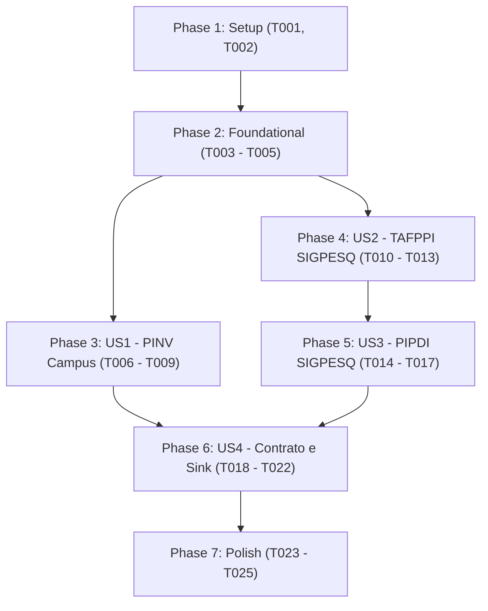

# Tasks: Integração do Cálculo Completo do Pilar 2 (PINV e PIPDI) no ETL

**Input**: Design documents from `specs/017-pillar2-pinv-pipdi-etl/`
**Prerequisites**: [plan.md](./plan.md), [spec.md](./spec.md), [research.md](./research.md), [data-model.md](./data-model.md), [contracts/](./contracts/)
**Tests**: MANDATORY per constitution Principle II (Test-First Development). Tests MUST be written BEFORE implementation and observed to fail first.

## Phase 1: Setup (Shared Infrastructure)

**Purpose**: Estrutura inicial e preparação das fontes de dados para o Pilar 2

- [x] T001 Validar a presença das fontes locais de dados (`data/pinv_serra.json` e `data/canonical/exports_canonical.zip`)
- [x] T002 [P] Configurar fixtures de teste com mock de projetos SIGPESQ e arquivo PINV em `tests/etl/conftest.py`

---

## Phase 2: Foundational (Modelos e Schemas do Pilar 2)

**Purpose**: Infraestrutura de dados e contratos que bloqueiam todas as histórias de usuário

**⚠️ CRITICAL**: Nenhuma história de usuário deve ser implementada antes da conclusão desta fase.

- [x] T003 [P] Atualizar schema de contrato CONIF aceitando `percentual_calculado_PINV` como número ou null em `specs/017-pillar2-pinv-pipdi-etl/contracts/pilar2-schema.json` e `specs/016-pillar2-facto-indicators/contracts/pilar2-schema.json`
- [x] T004 [P] Atualizar a dataclass `AgregadosPilar2` em `etl/core/logic/models/indicators.py` para permitir `float | int | None` no campo `percentual_calculado_pinv`
- [x] T005 Criar modelos de domínio `DadosPinvCampus`, `ProjetoSigpesqFinanciamento` e `FonteFinanciamento` em `etl/core/logic/models/pillar2_models.py`

**Checkpoint**: Modelos e schemas prontos para implementação das histórias de usuário.

---

## Phase 3: User Story 1 - Ingestão do Percentual Calculado de PINV por Campus (Priority: P1) 🎯 MVP

**Goal**: Ler `data/pinv_<campus>.json` e preencher `percentual_calculado_PINV` para o campus correspondente, mantendo `null` para campi sem arquivo.

**Independent Test**: Executar teste isolado com `data/pinv_serra.json` e verificar que `pilar2_serra_<ano>.json` contém `percentual_calculado_PINV` preenchido (496.78 em 2024, 1111.35 em 2025 e 610.63 em 2026) e outros campi permanecem `null`.

### Tests for User Story 1 (MANDATORY per constitution Principle II) ⚠️

- [x] T006 [P] [US1] Escrever testes unitários em `tests/etl/test_pinv_source.py` para leitura de `data/pinv_<campus>.json` (sucesso, arquivo ausente, fallback em data/raw/pilar2/)

### Implementation for User Story 1

- [x] T007 [P] [US1] Implementar o leitor de PINV por campus `PinvJsonSource` em `etl/adapters/sources/pinv_json_source.py`
- [x] T008 [US1] Implementar função `obter_percentual_pinv` em `etl/core/logic/calculators/pillar2.py`
- [x] T009 [US1] Integrar a atribuição de `percentual_calculado_pinv` no cálculo de campus em `etl/core/logic/calculators/aggregator.py`

**Checkpoint**: User Story 1 funcional e testável de forma independente como MVP.

---

## Phase 4: User Story 2 - Ingestão de Aporte Financeiro em Pesquisa SIGPESQ (TAFPPI em PINV) (Priority: P1)

**Goal**: Extrair dados de financiamento de `project_sigpesq_files_json/` do arquivo canônico e computar `TAFPPI_valor_total_aporte_pesquisa` para o ano de início de cada projeto.

**Independent Test**: Processar o ZIP canônico e validar que os aportes de Serra em 2024 (R$ 12.067.095,28), 2025 (R$ 28.270.178,52) e 2026 (R$ 17.842.650,00) são calculados exatamente.

### Tests for User Story 2 (MANDATORY per constitution Principle II) ⚠️

- [x] T010 [P] [US2] Escrever testes unitários em `tests/etl/test_sigpesq_funding.py` para extração de valores, fontes e datas de `project_sigpesq_files_json/PJ_*.json`

### Implementation for User Story 2

- [x] T011 [P] [US2] Estender o extrator `ZipCanonicalSource` em `etl/adapters/sources/zip_canonical_source.py` para extrair os objetos de financiamento de `project_sigpesq_files_json/`
- [x] T012 [US2] Atualizar a função `calcular_tafppi` em `etl/core/logic/calculators/pillar2.py` somando os aportes em R$ dos projetos iniciados no ano de referência (`ano_inicio == ano`)
- [x] T013 [US2] Consolidar o somatório de TAFPPI no escopo institucional `todos` em `etl/core/logic/calculators/aggregator.py`

**Checkpoint**: User Story 2 funcional com somatório exato de recursos financeiros de novos projetos.

---

## Phase 5: User Story 3 - Ingestão de Acordos de Parceria para PDeI (PIPDI / NAPPCT) do SIGPESQ (Priority: P2)

**Goal**: Identificar projetos do SIGPESQ com fontes externas (empresas e agências) vigentes no ano e computar `NAPPCT_acordos_parceria_firmados` e `total_acumulado_PIPDI`.

**Independent Test**: Validar que projetos com ArcelorMittal, FAPES, FINEP, Samarco, etc. ativos no ano incrementam o contador de acordos de parceria.

### Tests for User Story 3 (MANDATORY per constitution Principle II) ⚠️

- [x] T014 [P] [US3] Escrever testes unitários em `tests/etl/test_pipdi_sigpesq.py` para filtro de vigência anual e elegibilidade de parcerias com entidades externas

### Implementation for User Story 3

- [x] T015 [US3] Implementar método de elegibilidade de parceria externa para projetos SIGPESQ em `etl/core/logic/calculators/pillar2.py`
- [x] T016 [US3] Atualizar `calcular_pipdi` em `etl/core/logic/calculators/pillar2.py` para quantificar parcerias ativas por campus e ano
- [x] T017 [US3] Consolidar a contagem de acordos PIPDI no escopo institucional `todos` em `etl/core/logic/calculators/aggregator.py`

**Checkpoint**: User Story 3 funcional com contabilização de acordos de parceria do ecossistema.

---

## Phase 6: User Story 4 - Validação de Contrato, Sink e Governança CONIF (Priority: P3)

**Goal**: Garantir que o sink e os scripts de auditoria aceitem os novos campos do Pilar 2 sem rejeitar o pacote público e sem expor dados sensíveis (LGPD).

**Independent Test**: Executar `make check-dados` e `pytest tests/etl/` garantindo 100% de sucesso.

### Tests for User Story 4 (MANDATORY per constitution Principle II) ⚠️

- [x] T018 [P] [US4] Escrever testes de contrato em `tests/etl/test_pilar2_contract.py` validando os arquivos gerados contra `pilar2-schema.json`

### Implementation for User Story 4

- [x] T019 [US4] Atualizar `json_pilar_sink.py` para serializar `percentual_calculado_PINV` (float com 2 casas decimais ou null)
- [x] T020 [US4] Atualizar `CAMPOS_QUE_DEVEM_SER_NULOS` e regras de validação em `etl/adapters/sinks/zip_indicadores_sink.py` para autorizar `percentual_calculado_PINV`
- [x] T021 [US4] Atualizar validação de contrato e frescor em `etl/scripts/check_dados.py`
- [x] T022 [US4] Integrar a orquestração do novo fluxo de Pilar 2 no entrypoint `etl/main.py`

**Checkpoint**: Pacote `data/dist/indicadores.zip` gerado com todos os dados e validado com sucesso.

---

## Phase 7: Polish & Cross-Cutting Concerns

**Purpose**: Qualidade final, linting, formatação e verificação completa

- [x] T023 [P] Executar linting e formatação com `make lint` e `make format-check`
- [x] T024 Executar pipeline completo com `make etl` e validar com `make check-dados`
- [x] T025 Atualizar o relatório de auditoria do ETL em `data/reports/etl_run_report.md`

---

## Dependencies & Execution Order

## Parallel Execution Opportunities

- **Testes (Test-First)**: `T006`, `T010`, `T014` e `T018` podem ser escritos em paralelo uma vez que a Fase 2 esteja concluída.
- **US1 e US2**: Podem ser desenvolvidas de forma desacoplada pois US1 trata do arquivo JSON de PINV e US2 trata da extração do ZIP canônico do SIGPESQ.
