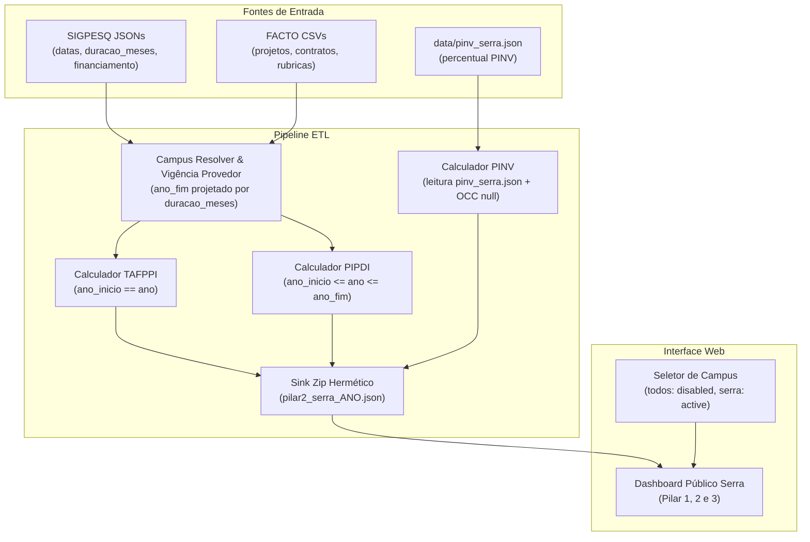

# Phase 1 Data Model: Refinamento do Pilar 2 e Consolidação Exclusiva do Campus Serra

**Feature**: `018-serra-pillar2-refinement`  
**Date**: 2026-10-08

## Entidades e Modelos de Dados

### 1. `ProjetoSigpesqFinanciamento` (Modelo do Domínio ETL)

Representa um projeto de pesquisa com dados de financiamento extraído do SIGPESQ.

```python
class ProjetoSigpesqFinanciamento:
    codigo: str              # Código do projeto (ex.: 'PJ 8503', 'PJ 8504')
    titulo: str | None       # Título completo do projeto
    campus_slug: str         # Slug do campus de execução ('serra', 'vitoria', etc.)
    campus_nome: str         # Nome legível do campus ('Serra', 'Vitória', etc.)
    ano_inicio: int | None   # Ano de início da vigência (ex.: 2025)
    ano_fim: int | None      # Ano de encerramento da vigência (projetado ou explícito)
    valor_total: float       # Valor total do aporte financeiro em R$
    fontes: list[FonteFinanciamento]  # Rubricas e fontes detalhadas
```

#### Regras de Projeção de Vigência:

- `ano_inicio`: Extraído de `datas.inicio` via regex `r"(\d{4})"`.
- `ano_fim`:
  1. Se `datas.fim` contiver ano válido (`YYYY`), adota esse ano.
  2. Caso contrário, se `datas.duracao_meses` for informado e positivo:
     $$\text{ano\_fim} = \text{ano\_inicio} + \lfloor \frac{\text{mes\_inicio} - 1 + \text{duracao\_meses} - 1}{12} \rfloor$$
  3. Caso contrário, fallback: `ano_fim = ano_inicio`.
- `ativo_em_ano(ano)`: `ano_inicio <= ano <= ano_fim`.

---

### 2. `AgregadosPilar2` (Modelo de Saída dos Indicadores)

Estrutura consolidada gerada por campus e ano de referência:

| Campo                                       | Tipo              | Descrição                                  | Regra do Campus Serra                                                                                                             |
| :------------------------------------------ | :---------------- | :----------------------------------------- | :-------------------------------------------------------------------------------------------------------------------------------- |
| `TAFPPI_valor_total_aporte_pesquisa`        | `float` \| `None` | Valor total de fomento captado no ano (R$) | Soma de projetos SIGPESQ iniciados no ano + FACTO iniciados no ano com `eh_pdei == True`. Em 2025: R$ 25.954.326,84.              |
| `OCC_valor_orcamento_total_capital_custeio` | `None`            | Orçamento de capital e custeio próprio     | Estritamente `None` (Princípio III).                                                                                              |
| `percentual_calculado_PINV`                 | `float` \| `None` | Percentual de investimento                 | Lido de `data/pinv_serra.json` (496,78% em 2024; 1.111,35% em 2025; 610,63% em 2026).                                             |
| `NAPPCT_acordos_parceria_firmados`          | `int` \| `None`   | Quantidade de acordos vigentes             | Contagem de projetos SIGPESQ e contratos FACTO com parceria externa ativos no ano de referência (`ano_inicio <= ano <= ano_fim`). |
| `total_acumulado_PIPDI`                     | `int` \| `None`   | Total acumulado de acordos                 | Idêntico ao NAPPCT.                                                                                                               |

---

### 3. `ContextoVisualizacao` (Modelo de Frontend / Interface Web)

Estrutura que governa o estado dos filtros e renderização no cliente:

```typescript
interface ContextoVisualizacao {
  campus: 'serra'; // Fixado no Campus Serra (única opção habilitada)
  ano: number; // Ano selecionado (ex.: 2024, 2025 ou 2026)
  ajustado: boolean; // Indica se houve ajuste automático de parâmetro
}

interface CampusOpcaoUI {
  slug: string; // 'serra' ou 'todos'
  nome: string; // 'Serra' ou '(Todos) (Desativado)'
  disabled: boolean; // true para 'todos', false para 'serra'
}
```

---

## Relações e Fluxo de Dados


