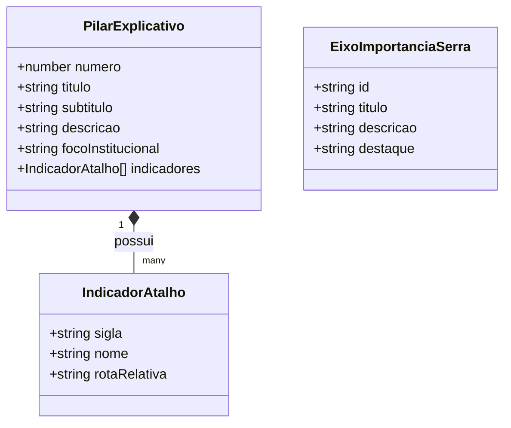

# Data Model: Nova Página Explicativa dos Pilares CONIF

**Feature**: `specs/019-conif-pillars-page`  
**Data**: 2026-10-09  
**Status**: Concluído

---

## 1. Visão Geral das Entidades

Embora a página seja estática (SSG), os dados conceituais e os blocos de conteúdo seguem uma estrutura tipada para garantir facilidade de manutenção, consistência entre os três pilares e fidelidade aos indicadores do repositório.

---

## 2. Definições de Tipos

### 2.1 `PilarExplicativo`

Representa as informações estruturadas de cada um dos 3 pilares do modelo CONIF.

| Campo               | Tipo                | Descrição                                                                                 |
| :------------------ | :------------------ | :---------------------------------------------------------------------------------------- |
| `numero`            | `number`            | Número ordinal do pilar (1, 2 ou 3).                                                      |
| `titulo`            | `string`            | Nome oficial do pilar no modelo CONIF.                                                    |
| `subtitulo`         | `string`            | Resumo de uma linha sobre o foco do pilar.                                                |
| `descricao`         | `string`            | Texto detalhado contextualizando objetivos e metodologia.                                 |
| `focoInstitucional` | `string`            | Destaque do aspecto mensurado (ex.: "Pessoas e Inclusão", "Sustentabilidade Financeira"). |
| `indicadores`       | `IndicadorAtalho[]` | Lista de indicadores vinculados ao pilar.                                                 |

### 2.2 `IndicadorAtalho`

Representa um link direto para a página de detalhes de um indicador específico.

| Campo          | Tipo     | Descrição                                                            |
| :------------- | :------- | :------------------------------------------------------------------- |
| `sigla`        | `string` | Sigla oficial (ex.: `NTPP`, `PINV`, `PIPRO`).                        |
| `nome`         | `string` | Nome completo do indicador.                                          |
| `rotaRelativa` | `string` | Caminho relativo para a página do indicador (ex.: `/pilar-1/ntpp/`). |

### 2.3 `EixoImportanciaSerra`

Representa os tópicos da seção dedicada ao impacto no Campus Serra.

| Campo       | Tipo     | Descrição                                                                      |
| :---------- | :------- | :----------------------------------------------------------------------------- |
| `id`        | `string` | Identificador único do eixo (ex.: `transparencia`, `governanca`, `parcerias`). |
| `titulo`    | `string` | Título do eixo institucional.                                                  |
| `descricao` | `string` | Justificativa do porquê o monitoramento é estratégico.                         |
| `destaque`  | `string` | Frase ou dado de impacto específico do ecossistema da Serra.                   |

---

## 3. Dados dos Pilares (Instâncias Canônicas)

### Pilar 1: Engajamento Acadêmico e Inclusão

- **Foco:** Participação de discentes, pesquisadores, bolsas e cotas.
- **Indicadores:**
  - `NTPP`: Número Total de Projetos de Pesquisa
  - `QSPP`: Quantitativo de Servidores em Projetos de Pesquisa
  - `PIES`: Percentual de Inclusão de Estudantes em Projetos de Pesquisa
  - `PICOT`: Percentual de Estudantes Cotistas em Projetos de Pesquisa

### Pilar 2: Fomento e Conexão com o Ecossistema

- **Foco:** Recursos captados, parcerias, prestação de serviços tecnológicos e inovação aberta.
- **Indicadores:**
  - `PINV`: Percentual de Recursos de Fontes Externas em Pesquisa e Inovação
  - `PIPDI`: Quantidade de Acordos de Parceria em PDeI
- **Destaque Serra:** Polo de Inovação / Unidade Embrapii em Sistemas Inteligentes de Manufatura.

### Pilar 3: Produtividade e Propriedade Intelectual

- **Foco:** Entregas acadêmicas, proteção de propriedade intelectual e transferência tecnológica.
- **Indicadores:**
  - `PIPRO`: Produção Intelectual de Pesquisa e Inovação por Servidor
  - `PIPROT`: Ativos de Propriedade Intelectual Protegidos
  - `PIPROTR`: Ativos de Propriedade Intelectual Transferidos
