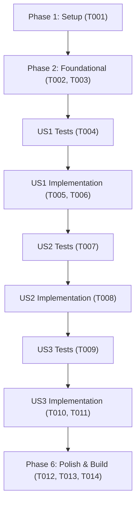

# Tasks: Nova Página Explicativa dos Pilares CONIF (Campus Serra)

**Input**: Design documents from `/specs/019-conif-pillars-page/`  
**Prerequisites**: `plan.md`, `spec.md`, `research.md`, `data-model.md`, `contracts/conif-page-contract.md`, `quickstart.md`  
**Tests**: Tests are MANDATORY for this project (constitution Principle II, Test-First Development). Tests MUST be written BEFORE implementation and observed to fail first.  
**Organization**: Tasks are grouped by user story to enable independent implementation and testing of each story.

## Format: `[ID] [P?] [Story] Description`

- **[P]**: Can run in parallel (different files, no dependencies)
- **[Story]**: Which user story this task belongs to (e.g., US1, US2, US3)
- Include exact file paths in descriptions

---

## Phase 1: Setup & Environment

**Purpose**: Verificação inicial do ambiente de desenvolvimento e testes do frontend

- [x] T001 Verificar ambiente Node.js e integridade da suíte de testes existente com npm run test:web

---

## Phase 2: Foundational (Infraestrutura Compartilhada)

**Purpose**: Suporte à nova rota nos testes e rotinas de comparação de caminho

- [x] T002 [P] Adicionar a rota 'src/pages/sobre-conif/index.astro' na lista de páginas monitoradas em tests/web/routes.test.ts
- [x] T003 [P] Validar suporte à normalização da rota 'sobre-conif' em tests/web/rota.test.ts

**Checkpoint**: Base de rotas configurada — implementação das histórias de usuário desbloqueada.

---

## Phase 3: User Story 1 - Compreensão do Modelo e dos 3 Pilares CONIF (Priority: P1) 🎯 MVP

**Goal**: Criar a página estática `/sobre-conif/` explicando didaticamente o modelo CONIF e seus 3 pilares, com atalhos diretos para os indicadores apurados do campus.

**Independent Test**: Acessar `http://localhost:4321/sobre-conif/` e verificar a presença do título institucional, da introdução ao CONIF e dos blocos dos 3 pilares com links para os 9 indicadores.

### Tests for User Story 1 (MANDATORY per constitution Principle II) ⚠️

- [x] T004 [P] [US1] Criar testes unitários e de contrato em tests/web/sobre-conif.test.ts validando existência da rota, estrutura semântica e links para os 9 indicadores oficiais

### Implementation for User Story 1

- [x] T005 [US1] Criar a página base em src/pages/sobre-conif/index.astro com breadcrumbs semânticos e introdução contextual sobre o CONIF
- [x] T006 [US1] Implementar as seções detalhadas dos 3 Pilares com cards explicativos e atalhos de navegação para os indicadores (NTPP, QSPP, PIES, PICOT, PINV, PIPDI, PIPRO, PIPROT, PIPROTR) em src/pages/sobre-conif/index.astro

**Checkpoint**: User Story 1 concluída e testável de forma independente como MVP funcional.

---

## Phase 4: User Story 2 - Relevância Estratégica para o Campus Serra (Priority: P2)

**Goal**: Explicar a importância prática do acompanhamento desses indicadores especificamente para a gestão, comunidade e ecossistema do Campus Serra.

**Independent Test**: Verificar na página `/sobre-conif/` a presença da seção temática detalhando Transparência Pública, Governança de Editais/Bolsas e o Polo Embrapii da Serra.

### Tests for User Story 2 (MANDATORY per constitution Principle II) ⚠️

- [x] T007 [P] [US2] Adicionar asserções em tests/web/sobre-conif.test.ts validando a seção de impacto institucional do Campus Serra e referências ao Polo Embrapii

### Implementation for User Story 2

- [x] T008 [US2] Implementar a seção 'Importância Estratégica para o Campus Serra' com os 3 eixos temáticos em src/pages/sobre-conif/index.astro

**Checkpoint**: User Stories 1 e 2 integradas e testadas.

---

## Phase 5: User Story 3 - Navegação no Cabeçalho, Gaveta Móvel e Home (Priority: P3)

**Goal**: Conectar a página `/sobre-conif/` à navegação global do portal no cabeçalho fixo, na gaveta móvel e em um card institucional na página inicial.

**Independent Test**: Clicar em 'Sobre o Modelo' no cabeçalho em desktop e na gaveta móvel em dispositivos móveis, e conferir o card de convite na página inicial `/`.

### Tests for User Story 3 (MANDATORY per constitution Principle II) ⚠️

- [x] T009 [P] [US3] Criar testes em tests/web/header-sobre-conif.test.ts validando presença do link no cabeçalho, na gaveta móvel e do card convidativo em src/pages/index.astro

### Implementation for User Story 3

- [x] T010 [US3] Adicionar o link 'Sobre o Modelo' com suporte a classe ativa e aria-current no cabeçalho e na gaveta móvel em src/layouts/BaseLayout.astro
- [x] T011 [US3] Adicionar card institucional de chamada para o modelo CONIF na página inicial em src/pages/index.astro

**Checkpoint**: Navegação global integrada e validada em todos os breakpoints.

---

## Phase 6: Polish & Cross-Cutting Concerns

**Purpose**: Verificação de acessibilidade, harmonia visual nos temas claro/escuro, qualidade de código e build de produção

- [x] T012 [P] Validar conformidade de contraste de cores (WCAG AA >= 4.5:1) e responsividade mobile em src/pages/sobre-conif/index.astro
- [x] T013 Executar análise estática e formatação de código com npm run lint e npm run format:check
- [x] T014 Executar suíte completa de testes com npm run test:web e build de produção com npm run build

---

## Dependencies & Execution Order

---

## Parallel Execution Opportunities

- **T002 e T003**: Podem ser executados em paralelo (arquivos de testes e rotas distintos).
- **T004 e T007**: Testes de US1 e US2 podem ser estruturados em paralelo antes da implementação das seções correspondentes.
- **T010 e T011**: A integração no layout e o card na Home podem ser desenvolvidos independentemente uma vez que a página `/sobre-conif/` já exista.
