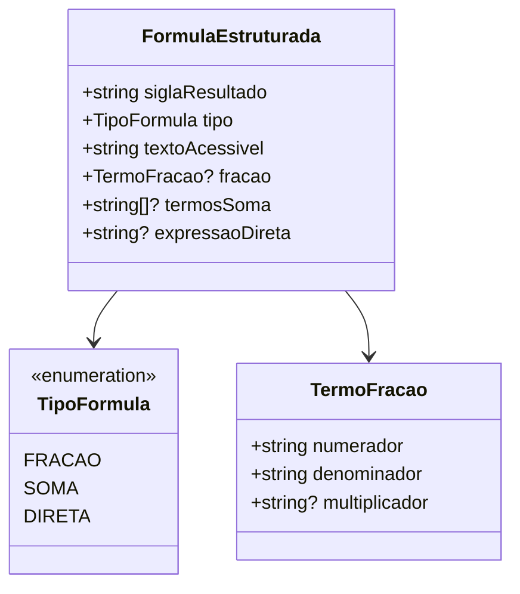

# Data Model: Renderização Tipográfica de Fórmulas Matemáticas

**Feature**: `specs/020-formula-typography`  
**Data**: 2026-10-09  
**Status**: Concluído

---

## 1. Modelo de Decomposição de Fórmula

---

## 2. Definições de Tipos (`src/lib/formula.ts`)

### 2.1 `TipoFormula`

Enumeração dos formatos possíveis de equação:

- `'fracao'`: fórmulas de razão/divisão com ou sem percentual (ex.: `PIES`, `PICOT`, `PINV`).
- `'soma'`: fórmulas com múltiplos termos aditivos (ex.: `PIPRO`, `PIPROT`, `PIPROTR`).
- `'direta'`: fórmulas de atribuição direta ou contagem declarada (ex.: `NTPP`, `QSPP`, `PIPDI`).

### 2.2 `FormulaEstruturada`

Objeto resultante da análise léxica da fórmula original:

| Campo             | Tipo           | Descrição                                                                             |
| :---------------- | :------------- | :------------------------------------------------------------------------------------ |
| `siglaResultado`  | `string`       | Símbolo à esquerda da igualdade (ex.: `PIES`).                                        |
| `tipo`            | `TipoFormula`  | Classificação do padrão matemático.                                                   |
| `textoAcessivel`  | `string`       | Transcrição fonética completa para leitores de tela em pt-BR.                         |
| `fracao`          | `TermoFracao?` | Presente se `tipo === 'fracao'`. Contém `numerador`, `denominador` e `multiplicador`. |
| `termosSoma`      | `string[]?`    | Presente se `tipo === 'soma'`. Lista ordenada dos símbolos a somar.                   |
| `expressaoDireta` | `string?`      | Presente se `tipo === 'direta'`. Texto literal do membro direito.                     |

---

## 3. Mapeamento das 9 Fórmulas Canônicas do Catálogo

| Indicador   | Fórmula Cadastrada                          | Tipo Identificado | Numerador | Denominador | Multiplicador |
| :---------- | :------------------------------------------ | :---------------: | :-------: | :---------: | :-----------: |
| **NTPP**    | `NTPP = Projetos registrados em execução`   |     `direta`      |     —     |      —      |       —       |
| **QSPP**    | `QSPP = SUPP`                               |     `direta`      |     —     |      —      |       —       |
| **PIES**    | `PIES = (NEP / NTE) × 100`                  |     `fracao`      |   `NEP`   |    `NTE`    |     `100`     |
| **PICOT**   | `PICOT = (NTECPP / NEP) × 100`              |     `fracao`      | `NTECPP`  |    `NEP`    |     `100`     |
| **PINV**    | `PINV = (TAFPPI / OCC) × 100`               |     `fracao`      | `TAFPPI`  |    `OCC`    |     `100`     |
| **PIPDI**   | `PIPDI = NAPPCT`                            |     `direta`      |     —     |      —      |       —       |
| **PIPRO**   | `PIPRO = NPB + NPT`                         |      `soma`       |     —     |      —      |       —       |
| **PIPROT**  | `PIPROT = PA + RM + DI + C + TC + PC + OGM` |      `soma`       |     —     |      —      |       —       |
| **PIPROTR** | `PIPROTR = CT + CL + CC`                    |      `soma`       |     —     |      —      |       —       |
