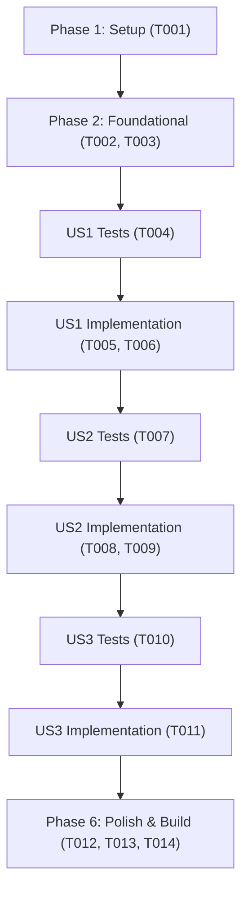

# Tasks: Renderização Tipográfica de Fórmulas Matemáticas

**Input**: Design documents from `/specs/020-formula-typography/`  
**Prerequisites**: `plan.md`, `spec.md`, `research.md`, `data-model.md`, `contracts/formula-contract.md`, `quickstart.md`  
**Tests**: Tests are MANDATORY for this project (constitution Principle II, Test-First Development). Tests MUST be written BEFORE implementation and observed to fail first.  
**Organization**: Tasks are grouped by user story to enable independent implementation and testing of each story.

## Format: `[ID] [P?] [Story] Description`

- **[P]**: Can run in parallel (different files, no dependencies)
- **[Story]**: Which user story this task belongs to (e.g., US1, US2, US3)
- Include exact file paths in descriptions

---

## Phase 1: Setup & Environment

**Purpose**: Verificação inicial do ambiente de testes e integridade do repositório

- [x] T001 Verificar integridade da suíte de testes de frontend existente com npm run test:web

---

## Phase 2: Foundational (Módulo Léxico de Fórmulas)

**Purpose**: Criação do módulo TypeScript responsável pelo parsing das 9 fórmulas oficiais e geração de texto acessível

- [x] T002 [P] Criar testes unitários para a decomposição e transcrição acessível das fórmulas em tests/web/formula.test.ts
- [x] T003 [P] Implementar funções decomporFormula e gerarTextoAcessivel em src/lib/formula.ts

**Checkpoint**: Módulo léxico de fórmulas testado e pronto para consumo pelos componentes.

---

## Phase 3: User Story 1 - Visualização Tipográfica de Frações e Operadores (Priority: P1) 🎯 MVP

**Goal**: Substituir a exibição de fórmulas monoespaçadas por um componente visual que apresente frações matemáticas verticais reais e operadores tipográficos.

**Independent Test**: Acessar `/pilar-1/pies/` e confirmar a presença da fração com numerador NEP acima e denominador NTE abaixo da barra horizontal, com multiplicação por 100 formatada.

### Tests for User Story 1 (MANDATORY per constitution Principle II) ⚠️

- [x] T004 [P] [US1] Criar testes de componente e contrato para renderização de frações e operadores em tests/web/formula-equacao.test.ts

### Implementation for User Story 1

- [x] T005 [US1] Criar o componente visual src/components/FormulaEquacao.astro com layout Flexbox para frações verticais, somas e constantes
- [x] T006 [US1] Integrar FormulaEquacao.astro na seção de fórmulas de src/components/IndicadorDetalhe.astro substituindo a tag code pura

**Checkpoint**: User Story 1 concluída e testável como MVP visual.

---

## Phase 4: User Story 2 - Correlação Interativa com a Tabela de Variáveis (Priority: P2)

**Goal**: Permitir que ao passar o cursor ou focar pelo teclado em uma variável na fórmula, a respectiva linha na tabela de variáveis seja realçada simultaneamente.

**Independent Test**: Passar o mouse ou focar via teclado no símbolo NEP na fórmula do PIES e confirmar que a linha da tabela referente a NEP ganha classe de destaque ativo.

### Tests for User Story 2 (MANDATORY per constitution Principle II) ⚠️

- [x] T007 [P] [US2] Adicionar asserções em tests/web/formula-equacao.test.ts validando presença dos atributos data-variavel-simbolo e data-linha-variavel

### Implementation for User Story 2

- [x] T008 [US2] Adicionar atributos data-linha-variavel nas linhas da tabela de variáveis em src/components/IndicadorDetalhe.astro
- [x] T009 [US2] Implementar script cliente leve e estilos de destaque visual bidirecional (.destaque-ativo) em src/components/IndicadorDetalhe.astro

**Checkpoint**: User Stories 1 e 2 integradas com interatividade funcional.

---

## Phase 5: User Story 3 - Acessibilidade Sonora para Leitores de Tela e Alto Contraste (Priority: P3)

**Goal**: Garantir que sintetizadores de voz pronunciem a fórmula em português claro e que todos os traços e textos respeitem as diretrizes WCAG AA nos temas claro e escuro.

**Independent Test**: Inspecionar o elemento .sr-only no DOM da fórmula e conferir a transcrição fonética e o contraste mínimo de 4.5:1 nos dois modos de cor.

### Tests for User Story 3 (MANDATORY per constitution Principle II) ⚠️

- [x] T010 [P] [US3] Criar testes em tests/web/formula-equacao.test.ts validando texto acessível sr-only e marcação aria-hidden na equação visual

### Implementation for User Story 3

- [x] T011 [US3] Ajustar estilos em src/components/FormulaEquacao.astro para usar tokens semânticos de tokens.css e garantir contraste estrito WCAG AA em ambos os temas

**Checkpoint**: Acessibilidade e suporte aos modos de cor completamente validados.

---

## Phase 6: Polish & Cross-Cutting Concerns

**Purpose**: Verificação de responsividade mobile, integridade do catálogo completo de indicadores, lint e build

- [x] T012 [P] Validar renderização de todas as 9 fórmulas do catálogo em telas estreitas e temas claro/escuro em src/components/FormulaEquacao.astro
- [x] T013 Executar análise estática e formatação de código com npm run lint e npm run format:check
- [x] T014 Executar suíte completa de testes com npm run test:web e build de produção com npm run build

---

## Dependencies & Execution Order

---

## Parallel Execution Opportunities

- **T002 e T003**: Testes e implementação do parser `src/lib/formula.ts` podem ser desenvolvidos em ciclo TDD direto.
- **T004 e T007**: Testes de componente e asserções de atributos de dados podem ser preparados em paralelo.
- **T008 e T010**: Estruturação dos atributos na tabela e verificação de classes acessíveis podem ocorrer conjuntamente.
