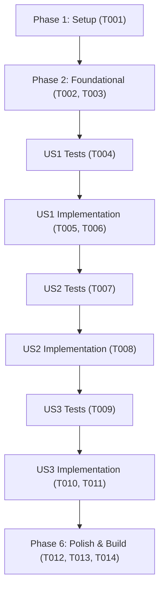

# Tasks: Alternância entre Gráfico de Linha e Barras no Histórico

**Input**: Design documents from `/specs/021-chart-view-toggle/`  
**Prerequisites**: `plan.md`, `spec.md`, `research.md`, `data-model.md`, `contracts/chart-contract.md`, `quickstart.md`  
**Tests**: Tests are MANDATORY for this project (constitution Principle II, Test-First Development). Tests MUST be written BEFORE implementation and observed to fail first.  
**Organization**: Tasks are grouped by user story to enable independent implementation and testing of each story.

## Format: `[ID] [P?] [Story] Description`

- **[P]**: Can run in parallel (different files, no dependencies)
- **[Story]**: Which user story this task belongs to (e.g., US1, US2, US3)
- Include exact file paths in descriptions

---

## Phase 1: Setup & Environment

**Purpose**: Verificação inicial do ambiente de testes e integridade do repositório

- [x] T001 Verificar integridade da suíte de testes de frontend existente com npm run test:web

---

## Phase 2: Foundational (Módulo Geométrico de Barras)

**Purpose**: Criação das funções de cálculo vetorial para posicionamento de colunas verticais no SVG

- [x] T002 [P] Criar testes unitários para a função mapearBarras e cálculo de colunas em tests/web/chart.test.ts
- [x] T003 [P] Implementar interface BarraGrafico e função mapearBarras em src/lib/chart.ts

**Checkpoint**: Módulo de cálculo vetorial de barras testado e pronto para uso pelo componente.

---

## Phase 3: User Story 1 - Visualização de Série em Gráfico de Barras e Controle de Alternância (Priority: P1) 🎯 MVP

**Goal**: Permitir que o usuário comute a visualização de série histórica de linha para colunas/barras verticais através de botões de alternância.

**Independent Test**: Acessar qualquer página de indicador (ex.: `/pilar-1/ntpp/` ou `/pilar-2/pipdi/`), clicar no botão "Barras" e confirmar que as colunas verticais são renderizadas com valores no topo e destaque no ano selecionado.

### Tests for User Story 1 (MANDATORY per constitution Principle II) ⚠️

- [x] T004 [P] [US1] Criar testes de componente validando presença dos botões de alternância e camadas SVG em tests/web/chart-toggle.test.ts

### Implementation for User Story 1

- [x] T005 [US1] Adicionar botões de alternância e camada SVG data-camada-barras em src/components/SeriesChart.astro
- [x] T006 [US1] Implementar script cliente leve para alternar visibilidade entre data-camada-linha e data-camada-barras em src/components/SeriesChart.astro

**Checkpoint**: User Story 1 concluída e testável como MVP visual.

---

## Phase 4: User Story 2 - Acessibilidade Semântica, Navegação por Teclado e Estados ARIA (Priority: P2)

**Goal**: Assegurar que os botões de alternância forneçam feedback sonoro via leitores de tela e obedeçam à navegação por teclado.

**Independent Test**: Focar nos botões de alternância via Tab, verificar anúncios com `aria-pressed="true|false"` e alternar o modo usando teclas Enter e Barra de Espaço.

### Tests for User Story 2 (MANDATORY per constitution Principle II) ⚠️

- [x] T007 [P] [US2] Adicionar asserções em tests/web/chart-toggle.test.ts validando role="group", aria-pressed e navegabilidade por teclado

### Implementation for User Story 2

- [x] T008 [US2] Implementar suporte a acionamento por teclado e sincronização bidirecional de aria-pressed nos botões em src/components/SeriesChart.astro

**Checkpoint**: User Story 2 concluída com acessibilidade WCAG AA validada.

---

## Phase 5: User Story 3 - Tratamento de Dados Indisponíveis, Contraste Temático e Persistência de Sessão (Priority: P3)

**Goal**: Garantir que anos sem dados sejam sinalizados como indisponíveis sem desenhar barras de valor zero, manter alto contraste em modo escuro e memorizar a escolha do usuário na sessão.

**Independent Test**: Conferir um ano com dado nulo no modo barra e confirmar a demarcação tracejada de "Indisp."; alternar para o tema escuro e validar o contraste; mudar de página e verificar se o modo selecionado foi restaurado via `sessionStorage`.

### Tests for User Story 3 (MANDATORY per constitution Principle II) ⚠️

- [x] T009 [P] [US3] Criar testes em tests/web/chart-toggle.test.ts para anos indisponíveis, persistência em sessionStorage e tokens de tema escuro

### Implementation for User Story 3

- [x] T010 [US3] Ajustar marcação visual de barras para anos indisponíveis com padrão tracejado e estilos de modo claro/escuro em src/components/SeriesChart.astro
- [x] T011 [US3] Implementar leitura e gravação da preferência no sessionStorage em src/components/SeriesChart.astro

**Checkpoint**: User Story 3 concluída com persistência de sessão e fidelidade total aos dados.

---

## Phase 6: Polish & Cross-Cutting Concerns

**Purpose**: Verificação de responsividade mobile, análise estática, formatação e build de produção

- [x] T012 [P] Validar responsividade do gráfico com alternância em viewports estreitos (mobile) e temas claro/escuro
- [x] T013 Executar análise estática e formatação com npm run lint e npm run format:check
- [x] T014 Executar suíte completa de testes com npm run test:web e build de produção com npm run build

---

## Dependencies & Execution Order

---

## Parallel Opportunities

- **T002 e T003**: Os testes de `chart.test.ts` e a implementação em `src/lib/chart.ts` podem ser desenvolvidos em ciclo TDD focado.
- **T004, T007 e T009**: Testes de integração em `tests/web/chart-toggle.test.ts` mapeando os contratos das US1, US2 e US3.
- **T012 e T013**: Validação de responsividade e linting após a integração.
