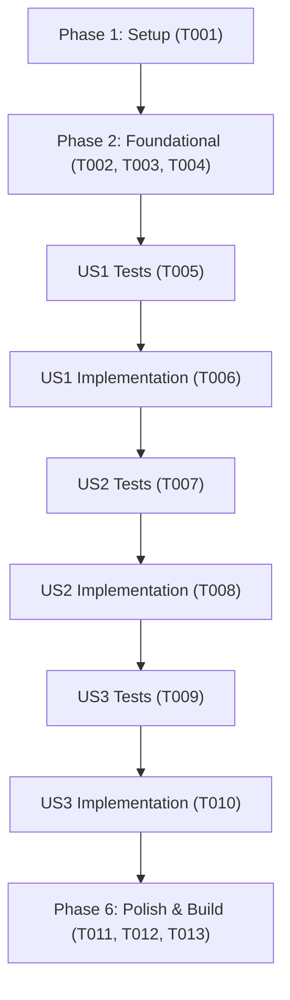

# Tasks: Ferramentas de Exportação (PNG, CSV) e Impressão A4

**Input**: Design documents from `/specs/022-export-and-print/`  
**Prerequisites**: `plan.md`, `spec.md`, `research.md`, `data-model.md`, `contracts/export-contract.md`, `quickstart.md`  
**Tests**: Tests are MANDATORY for this project (constitution Principle II, Test-First Development). Tests MUST be written BEFORE implementation and observed to fail first.  
**Organization**: Tasks are grouped by user story to enable independent implementation and testing of each story.

## Format: `[ID] [P?] [Story] Description`

- **[P]**: Can run in parallel (different files, no dependencies)
- **[Story]**: Which user story this task belongs to (e.g., US1, US2, US3)
- Include exact file paths in descriptions

---

## Phase 1: Setup & Environment

**Purpose**: Verificação inicial do ambiente de testes e integridade do repositório

- [x] T001 Verificar integridade da suíte de testes de frontend existente com npm run test:web

---

## Phase 2: Foundational (Módulos de Exportação CSV e Gráfico)

**Purpose**: Criação dos módulos utilitários em TypeScript para formatação de CSV e conversão gráfica

- [x] T002 [P] Criar testes unitários para formatação de CSV, BOM UTF-8 e delimitador em tests/web/exportar-csv.test.ts
- [x] T003 [P] Implementar módulo gerarCsvSerieHistorica e disparo de download em src/lib/exportar-csv.ts
- [x] T004 [P] Implementar função de renderização de SVG para Canvas e download em src/lib/exportar-grafico.ts

**Checkpoint**: Módulos utilitários de exportação testados e prontos para integração nos componentes.

---

## Phase 3: User Story 1 - Exportação da Série Histórica em Planilha CSV (Priority: P1) 🎯 MVP

**Goal**: Permitir que o usuário baixe a série histórica do indicador em arquivo CSV diretamente no componente de tabela histórica.

**Independent Test**: Acessar qualquer página de indicador (ex.: `/pilar-1/ntpp/`), clicar no botão "Exportar CSV" e confirmar que o arquivo baixado contém cabeçalho correto, codificação UTF-8 com BOM e separador `;`.

### Tests for User Story 1 (MANDATORY per constitution Principle II) ⚠️

- [x] T005 [P] [US1] Criar testes de componente validando presença do botão data-btn-exportar-csv e atributos acessíveis em tests/web/exportar-print.test.ts

### Implementation for User Story 1

- [x] T006 [US1] Integrar botão de exportação e script cliente de download CSV em src/components/HistoricalSeries.astro

**Checkpoint**: User Story 1 concluída e testável como MVP funcional.

---

## Phase 4: User Story 2 - Exportação do Gráfico em Imagem PNG Institucional (Priority: P2)

**Goal**: Permitir que o usuário baixe o gráfico histórico renderizado na tela (linha ou barra) em arquivo PNG com cabeçalho oficial do IFES.

**Independent Test**: Acessar `/pilar-2/pinv/`, clicar no botão "Baixar PNG" no gráfico e verificar se o arquivo baixado contém fundo branco nítido, título do indicador e cabeçalho institucional.

### Tests for User Story 2 (MANDATORY per constitution Principle II) ⚠️

- [x] T007 [P] [US2] Criar testes em tests/web/exportar-print.test.ts validando presença do botão data-btn-exportar-png e integração com o gráfico

### Implementation for User Story 2

- [x] T008 [US2] Integrar botão "Baixar PNG" e rotina de conversão Canvas em src/components/SeriesChart.astro

**Checkpoint**: User Story 2 concluída com exportação de imagens em alta qualidade.

---

## Phase 5: User Story 3 - Ficha do Indicador Otimizada para Impressão A4 (Priority: P3)

**Goal**: Permitir que o usuário imprima a ficha do indicador ou gere PDF limpo com cabeçalho institucional e sem elementos de navegação web.

**Independent Test**: Clicar no botão "Imprimir Ficha" em `/pilar-3/pipro/` ou abrir a caixa de diálogo de impressão e verificar a supressão de menus, rodapés e botões, além da presença do cabeçalho formal impresso.

### Tests for User Story 3 (MANDATORY per constitution Principle II) ⚠️

- [x] T009 [P] [US3] Criar testes em tests/web/exportar-print.test.ts validando regras @media print, botão de impressão e cabeçalho formal

### Implementation for User Story 3

- [x] T010 [US3] Adicionar botão de impressão, cabeçalho institucional impresso e regras CSS @media print em src/components/IndicadorDetalhe.astro

**Checkpoint**: User Story 3 concluída com suporte completo a impressão A4.

---

## Phase 6: Polish & Cross-Cutting Concerns

**Purpose**: Verificação em mobile, temas claro/escuro, análise estática e build de produção

- [x] T011 [P] Validar comportamento dos botões e regras de impressão em viewport mobile e temas claro/escuro
- [x] T012 Executar análise estática e formatação com npm run lint e npm run format:check
- [x] T013 Executar suíte completa de testes com npm run test:web e build de produção com npm run build

---

## Dependencies & Execution Order

---

## Parallel Opportunities

- **T002, T003 e T004**: Desenvolvimento dos módulos utilitários em `src/lib/` e seus testes unitários em `tests/web/`.
- **T005, T007 e T009**: Testes de integração em `tests/web/exportar-print.test.ts` cobrindo os botões e regras de impressão.
- **T011 e T012**: Validação visual e análise estática.
