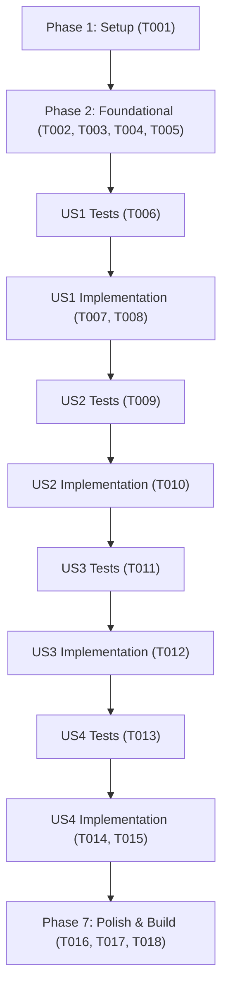

# Tasks: Matriz Geral Consolidada de Indicadores e Filtros por Tags Temáticas

**Input**: Design documents from `/specs/023-consolidated-matrix-tags/`  
**Prerequisites**: `plan.md`, `spec.md`, `research.md`, `data-model.md`, `contracts/matriz-contract.md`, `quickstart.md`  
**Tests**: Tests are MANDATORY for this project (constitution Principle II, Test-First Development). Tests MUST be written BEFORE implementation and observed to fail first.  
**Organization**: Tasks are grouped by user story to enable independent implementation and testing of each story.

## Format: `[ID] [P?] [Story] Description`

- **[P]**: Can run in parallel (different files, no dependencies)
- **[Story]**: Which user story this task belongs to (e.g., US1, US2, US3, US4)
- Include exact file paths in descriptions

---

## Phase 1: Setup & Environment

**Purpose**: Verificação inicial do ambiente de testes e integridade do repositório

- [x] T001 Verificar integridade da suíte de testes de frontend existente com npm run test:web

---

## Phase 2: Foundational (Módulo de Dados e Utilitários da Matriz)

**Purpose**: Criação dos módulos utilitários em TypeScript para catálogo de tags, enriquecimento e filtragem

- [x] T002 [P] Criar testes unitários para o catálogo de tags e enriquecimento de dados em tests/web/matriz-dados.test.ts
- [x] T003 [P] Implementar módulo de catálogo de tags e função obterIndicadoresMatriz em src/lib/matriz.ts
- [x] T004 [P] Criar testes unitários para funções de filtragem e ordenação em tests/web/matriz-filtros.test.ts
- [x] T005 [P] Implementar funções filtrarIndicadores e ordenarIndicadores com normalização textual em src/lib/matriz.ts

**Checkpoint**: Módulo `src/lib/matriz.ts` 100% testado e pronto para consumo nos componentes Astro.

---

## Phase 3: User Story 1 - Visão Tabular Consolidada dos Indicadores do Campus Serra (Priority: P1) 🎯 MVP

**Goal**: Apresentar todos os 9 indicadores do Campus Serra em uma tabela consolidada na rota `/matriz/`, com colunas informativas e ordenação por cabeçalho.

**Independent Test**: Acessar `/matriz/`, verificar a listagem de todos os 9 indicadores com seus valores, variações e links para as fichas detalhadas, testando a ordenação pelas colunas Pilar, Sigla e Nome.

### Tests for User Story 1 (MANDATORY per constitution Principle II) ⚠️

- [x] T006 [P] [US1] Criar testes de componente para marcação semântica da tabela, colunas e atributos aria-sort em tests/web/matriz-componente.test.ts

### Implementation for User Story 1

- [x] T007 [US1] Implementar componente de tabela consolidada com cabeçalhos ordenáveis em src/components/MatrizIndicadores.astro
- [x] T008 [US1] Criar página estática da matriz em src/pages/matriz/index.astro integrando com BaseLayout

**Checkpoint**: User Story 1 concluída e testável como MVP funcional (tabela geral acessível e navegável).

---

## Phase 4: User Story 2 - Filtragem Rápida por Tags Temáticas (Priority: P2)

**Goal**: Permitir que o usuário filtre instantaneamente a tabela por áreas temáticas através de chips interativos no topo da tabela.

**Independent Test**: Clicar nos chips de tags (ex.: "Pesquisa", "Inovação", "Todas") e validar que apenas as linhas correspondentes permanecem visíveis e os contadores estão corretos.

### Tests for User Story 2 (MANDATORY per constitution Principle II) ⚠️

- [x] T009 [P] [US2] Criar testes de componente para os chips de tags com role="group", aria-pressed e contadores em tests/web/matriz-componente.test.ts

### Implementation for User Story 2

- [x] T010 [US2] Integrar barra de chips de tags com script cliente reativo em src/components/MatrizIndicadores.astro

**Checkpoint**: User Story 2 concluída com filtragem rápida por categorias temáticas.

---

## Phase 5: User Story 3 - Busca Textual Instantânea Integrada (Priority: P3)

**Goal**: Permitir que o usuário busque indicadores por sigla, nome ou palavra-chave com filtragem em tempo real e estado vazio amigável.

**Independent Test**: Digitar termos parciais com ou sem acentos no campo de busca da matriz e verificar a filtragem em tempo real e a mensagem de zero resultados.

### Tests for User Story 3 (MANDATORY per constitution Principle II) ⚠️

- [x] T011 [P] [US3] Criar testes para o campo de busca em tempo real, normalização e aviso de estado vazio em tests/web/matriz-componente.test.ts

### Implementation for User Story 3

- [x] T012 [US3] Integrar campo de busca em tempo real com normalização e estado vazio em src/components/MatrizIndicadores.astro

**Checkpoint**: User Story 3 concluída com busca dinâmica cumulativa com as tags.

---

## Phase 6: User Story 4 - Integração na Navegação Global e Responsividade Móvel (Priority: P4)

**Goal**: Conectar a matriz geral aos menus de navegação desktop e gaveta móvel, além de incluir atalho na página inicial.

**Independent Test**: Navegar até a matriz pelo menu do cabeçalho, gaveta móvel e card na home, verificando indicador aria-current="page" e layout responsivo.

### Tests for User Story 4 (MANDATORY per constitution Principle II) ⚠️

- [x] T013 [P] [US4] Criar testes em tests/web/matriz-navegacao.test.ts validando links no menu principal, gaveta móvel e home

### Implementation for User Story 4

- [x] T014 [US4] Adicionar link "Matriz" no menu desktop e na gaveta móvel em src/layouts/BaseLayout.astro
- [x] T015 [US4] Adicionar card de atalho para a Matriz Geral de Indicadores na página inicial em src/pages/index.astro

**Checkpoint**: User Story 4 concluída com integração completa à navegação do site.

---

## Phase 7: Polish & Cross-Cutting Concerns

**Purpose**: Verificação em viewport mobile, compatibilidade com temas claro/escuro, análise estática e build de produção

- [x] T016 [P] Validar layout responsivo com rolagem horizontal e conformidade cromática com tokens.css nos temas claro e escuro
- [x] T017 Executar análise estática com npm run lint e validação de formatação com npm run format:check
- [x] T018 Executar suíte completa de testes com npm run test:web e build de produção com npm run build

---

## Dependencies & Execution Order

---

## Parallel Opportunities

- **T002, T003 e T004, T005**: Funções de enriquecimento de dados e filtragem em `src/lib/matriz.ts` e seus testes unitários em `tests/web/`.
- **T006, T009, T011 e T013**: Testes unitários e de integração desenvolvidos de forma isolada em arquivos de testes independentes.
- **T014 e T015**: Inclusão de links na navegação de `BaseLayout.astro` e card na Home em `index.astro`.
